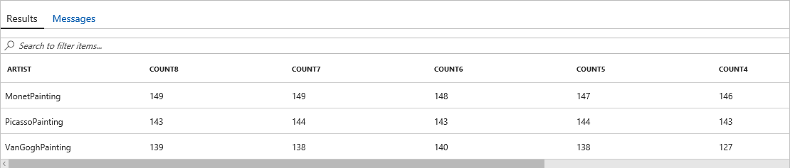
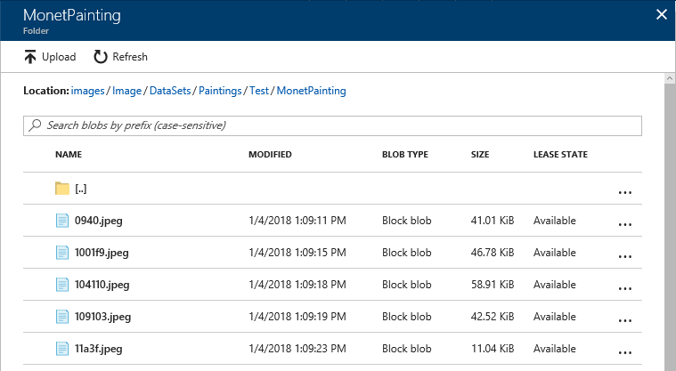

In this lab, the second of four in a series, you will prepare the data that you generated and stored in an Azure SQL database in the [previous lab](../1%20-%20Ingest) so that it can be used to train a machine-learning model that performs image classification. Preparation will involve using a technique called [perceptual image hashing](https://www.pyimagesearch.com/2017/11/27/image-hashing-opencv-python/) to identify images that are identical or highly similar so the model won't be biased by training it with multiple variations of the same image. In the [next lab](../3%20-%20Predict), you will use the images that you generated to train a machine-learning model that recognizes the artists of famous paintings.


<a name="Objectives"></a>
### Objectives ###

In this hands-on lab, you will learn how to:

- Use an Azure SQL database as a data source in Machine Learning Workbench
- Use perceptual image hashing to identify similar images
- Make decisions on what hashing is best given the project objectives
- Upload chosen images to Azure Blob Storage for further processing

<a name="Prerequisites"></a>
### Prerequisites ###

The following are required to complete this hands-on lab:

- An active Microsoft Azure subscription. If you don't have one, [sign up for a free trial](http://aka.ms/WATK-FreeTrial).
- [Azure Machine Learning Workbench](https://docs.microsoft.com/en-us/azure/machine-learning/preview/quickstart-installation)
- [Docker](https://www.docker.com/)

If you haven't completed the [previous lab in this series](../1%20-%20Ingest), you must do so before starting this lab.

---

<a name="Exercises"></a>
## Exercises ##

This hands-on lab includes the following exercises:

- [Exercise 1: Connect to Azure SQL from ML Workbench](#Exercise1)
- [Exercise 2: Create a Standard Azure Blob Storage for Images](#Exercise2)
- [Exercise 3: View similar images using a Jupyter Notebook inside Azure ML Workbench](#Exercise3)
- [Exercise 4: Determine Unique Paintings with a Pandas DataFrame](#Exercise4)
- [Exercise 5: Upload Unique Painting Thumbnails into Azure Blob Storage](#Exercise5)

Estimated time to complete this lab: **45** minutes.

<a name="Exercise1"></a>
## Exercise 1: Connect to Azure SQL from ML Workbench ##

In this exercise, you will connect to the Azure SQL database you created in the previous lab from Azure Machine Learning Workbench by specifying the database as a data source.

1. Open the [Azure Portal](https://portal.azure.com) in your browser. If asked to log in, do so using your Microsoft account.

1. Launch Azure Machine Learning Workbench and open the project that you created in the previous lab. Then click the **Data** icon in the ribbon on the left, click the **+** sign, and select **Add Data Source**.

	

	_Adding a data source_

1. Click **Database**, and then click the **Next** button.

	

	_Adding a database as a data source_

1. In the **Server Address** box, enter "SERVER_NAME.database.windows.net" (without quotation marks), where SERVER_NAME is the name you assigned to the database server in the previous lab. Make sure **Server** is selected as the **Authentication Type**, and enter the admin user name and password that you specified in the previous lab for logging in to the database. In **Database To Connect To**, enter the name you assigned to the database in the previous lab. Then scroll down and enter the following statement into the **Query** box:

	```
	SELECT * FROM dbo.Paintings
	```

	Then finish up by clicking the **Finish** button.

	

	_Adding an Azure SQL database as a data source_

1. Confirm that the contents of the "Paintings" table appears in ML Workbench, complete with columns named "Artist,"  "Artist Number," "Width," "Height," and other fields.

	

	_Data imported from the Azure SQL database_

1. Now that you have connected to the database, let's start on the feature analysis for this lab.  During the **load.py** script, we applied a dHash algorithm to the included images (see https://pypi.python.org/pypi/dhash).  The default bit size recommended is 8, but you have already calculated all the values from 8 down to one.  Going up in bit size makes a more fine-grained image, but going down in size makes a more pixelated comparison.  Let's look at the distribution of unique images (determined by dHash values) by artist.  NOTE: the current version of Azure ML Workbench does not run our query, but we are showing the place where you could edit your query:  this interface is intended to give only small tables, so try experimenting with what is possible.

	

	_Edit Workbench Query_

1. Below is SQL code which uses common table expressions (CTEs) to tabulate the number of unique images by Artist.  Copy this code, and paste into Data Explorer (as we did in Lab 1, Exercise 5).

    ``` SQL
    WITH RowTagging
    AS (SELECT [Artist],
               ROW_NUMBER() OVER (PARTITION BY Artist, DHashHex8 ORDER BY Width DESC, Height DESC) AS RowNumber8,
               ROW_NUMBER() OVER (PARTITION BY Artist, DHashHex7 ORDER BY Width DESC, Height DESC) AS RowNumber7,
               ROW_NUMBER() OVER (PARTITION BY Artist, DHashHex6 ORDER BY Width DESC, Height DESC) AS RowNumber6,
               ROW_NUMBER() OVER (PARTITION BY Artist, DHashHex5 ORDER BY Width DESC, Height DESC) AS RowNumber5,
               ROW_NUMBER() OVER (PARTITION BY Artist, DHashHex4 ORDER BY Width DESC, Height DESC) AS RowNumber4,
               ROW_NUMBER() OVER (PARTITION BY Artist, DHashHex3 ORDER BY Width DESC, Height DESC) AS RowNumber3,
               ROW_NUMBER() OVER (PARTITION BY Artist, DHashHex2 ORDER BY Width DESC, Height DESC) AS RowNumber2,
               ROW_NUMBER() OVER (PARTITION BY Artist, DHashHex1 ORDER BY Width DESC, Height DESC) AS RowNumber1
        FROM [dbo].[Paintings]),
         Count8
    AS (SELECT R.Artist,
               COUNT(*) AS Count8
        FROM RowTagging R
        WHERE RowNumber8 = 1
        GROUP BY R.Artist),
         Count7
    AS (SELECT R.Artist,
               COUNT(*) AS Count7
        FROM RowTagging R
        WHERE RowNumber7 = 1
        GROUP BY R.Artist),
         Count6
    AS (SELECT R.Artist,
               COUNT(*) AS Count6
        FROM RowTagging R
        WHERE RowNumber6 = 1
        GROUP BY R.Artist),
         Count5
    AS (SELECT R.Artist,
               COUNT(*) AS Count5
        FROM RowTagging R
        WHERE RowNumber5 = 1
        GROUP BY R.Artist),
         Count4
    AS (SELECT R.Artist,
               COUNT(*) AS Count4
        FROM RowTagging R
        WHERE RowNumber4 = 1
        GROUP BY R.Artist),
         Count3
    AS (SELECT R.Artist,
               COUNT(*) AS Count3
        FROM RowTagging R
        WHERE RowNumber3 = 1
        GROUP BY R.Artist),
         Count2
    AS (SELECT R.Artist,
               COUNT(*) AS Count2
        FROM RowTagging R
        WHERE RowNumber2 = 1
        GROUP BY R.Artist),
         Count1
    AS (SELECT R.Artist,
               COUNT(*) AS Count1
        FROM RowTagging R
        WHERE RowNumber1 = 1
        GROUP BY R.Artist)
    SELECT A.Artist,
           A.Count8,
           B.Count7,
           C.Count6,
           D.Count5,
           E.Count4,
           F.Count3,
           G.Count2,
           H.Count1
    FROM Count8 A
        LEFT JOIN Count7 B
            ON B.Artist = A.Artist
        LEFT JOIN Count6 C
            ON C.Artist = A.Artist
        LEFT JOIN Count5 D
            ON D.Artist = A.Artist
        LEFT JOIN Count4 E
            ON E.Artist = A.Artist
        LEFT JOIN Count3 F
            ON F.Artist = A.Artist
        LEFT JOIN Count2 G
            ON G.Artist = A.Artist
        LEFT JOIN Count1 H
            ON H.Artist = A.Artist;
    ``` 

	

	_Distribution of unique dHash values by Artist_

1. Mathematically, the results are as we expect:  as we decrease the bit size of the dHash, the number of unique images goes down.  Look to the right to see how many survive with a bit size of one.  Note that in dHash the actual bit size is the specified **size** plus one (in case those results for dHash one seem odd).


In this first exercise, we looked at the created dataset using Azure ML Workbench, and also through the browser interface.  The topic about hashing brings up an important question:  what is a "unique image" for the purpose of this project?  We continue our investigation in the next exercise.

<a name="Exercise2"></a>
## Exercise 2: Create a Standard Azure Blob Storage for Images ##

In this exercise, you will use the Azure CLI to create an Azure storage account in the cloud. This storage account will store as blobs images acquired from Bing Image Search, and subsequently be used for the HDInsight Spark cluster. Note that you can also create storage accounts using the [Azure Portal](https://portal.azure.com). Whether to use the CLI or the portal is often a matter of personal preference.

1. If the Azure CLI 2.0 isn't installed on your computer, go to https://docs.microsoft.com/cli/azure/install-azure-cli and install it now. You can determine whether the CLI is installed — and what version is installed — by opening a Command Prompt or terminal window and typing the following command:

	```
	az -v
	```

	If the CLI is installed, the version number will be displayed. If the version number is less than 2.0.23, **download and install the latest version**.

	> As an alternative to installing the Azure CLI, you can use the [Azure Cloud Shell](https://azure.microsoft.com/features/cloud-shell/) available in the [Azure Portal](https://portal.azure.com). Simply open the portal in your browser and click the **Cloud Shell** button in the toolbar at the top of the page. One of the benefits of using the Cloud Shell is that you're *always* running the latest version.

	

	_Opening the Azure Cloud Shell_

1. Now use the following command to create a general-purpose storage account in the "mmlsparklab-rg" resource group created in lab one. Replace ACCOUNT_NAME with the name you wish to assign the storage account. The account name must be unique within Azure, so if the command fails because the storage-account name is already in use, change the name and try again. In addition, storage-account names must be from 3 to 24 characters in length and can contain only numbers and lowercase letters.

	```
	az storage account create --name ACCOUNT_NAME --resource-group mmlsparklab-rg --location southcentralus --kind Storage --sku Standard_LRS
	```

1. Before you can upload blobs to a storage account, you must create a container to store them in. Use the following command to create a container named "images" in the storage account, replacing ACCOUNT_NAME with the name you assigned to the storage account in the previous step:

	```
	az storage container create --name images --account-name ACCOUNT_NAME
	```
1. Use the Azure Portal to obtain the ACCESS KEY for this newly created Storage Account.

	

	_Copying the Access Key_

You now have a storage account for storing images for this lab, and a container to store them in. Now let's determine the set of unique paintings for this lab.


<a name="Exercise3"></a>
## Exercise 3 (Optional): View similar images using a Jupyter Notebook inside Azure ML Workbench ##

In this section, we will look at some of the similar images.  Particularly, we are going to display images which have different values for the 8-bit dHash but identical for the 3-bit dHash.  For the purposes of this lab, we will be choosing the 3-bit as appropriate for our goals, to distinguish digital images of paintings as being different from the perspective of amateurs.  Had we had higher resolution photographs, our goals would be different:  however, in this exercise we will show what a "similar" 3-bit image looks like to give you a feel for how the dHash algorithm works.   We have marked this exercise as **Optional** because it did not work with our Python Docker instance, but only a local installation of Python.  If your setup allows for running this optional exercise, we recommend looking at it.

1.  Using Azure ML Workbench, navigate to the notebook item, and start a new notebook.  Name the notebook *dhash analysis*.
	

	_Creating a new Jupyter notebook in Azure ML Workbench_

1.  Once you make the notebook, the screen look as follows.  Note that there is connection code in the first cell.  Press **Start Notebook Server** to start your Jupyter service.  
	

	_Start Notebook Server_

1.  If you are prompted to pick a kernel, choose **Python 3**.  Jupyter technology gives you the opportunity to choose among kernels installed on a particular machine.

    

	_An active Kernel running_

1.  Enter the following code into the second cell in the panel.  You will need to make some connection substitutions (for accessing the database).  

    ``` Python
    # SQL to Pandas
    #
    # Use case:
    # 1) pre-processing data with Python as Pandas
    # 2) achieving pre-processing in Azure ML Workbench

    # SQL Alchemy for full relational power
    # http://docs.sqlalchemy.org/en/latest/core/engines.html
    from sqlalchemy import create_engine

    # Pandas for Dataframe
    # https://pypi.python.org/pypi/pandas
    import pandas as pd

    # https://pypi.python.org/pypi/Pillow
    from PIL import Image
    from PIL import ImageDraw
    from PIL import ImageFont
    import matplotlib.pyplot as plt
    import numpy as np
    %matplotlib inline

    # BytesIO to obtain from URL
    # https://wiki.python.org/moin/BytesIO
    from io import BytesIO

    # HTTP for humans
    # https://pypi.python.org/pypi/requests
    import requests

    # Create Engine
    # http://docs.sqlalchemy.org/en/latest/dialects/mssql.html#module-sqlalchemy.dialects.mssql.pyodbc
    engine = create_engine("mssql+pyodbc://<ADMIN USERNAME>:<ADMIN PASSWORD>@<SERVER NAME>.database.windows.net:1433/<DATABASE NAME>?driver=ODBC+Driver+13+for+SQL+Server")

    # read into pandas dataframe
    # http://pandas.pydata.org/pandas-docs/stable/generated/pandas.read_sql.html
    sqlquery = 'WITH Numbering \
        AS (SELECT P.Artist, \
                P.URL, \
                p.DHashHex3, \
                ROW_NUMBER() OVER (PARTITION BY Artist, DHashHex3 ORDER BY Width DESC, Height DESC) AS RowNumber3, \
                ROW_NUMBER() OVER (PARTITION BY Artist, DHashHex8 ORDER BY Width DESC, Height DESC) AS RowNumber8 \
            FROM dbo.Paintings P), \
            Uniquing \
        AS (SELECT N.Artist, \
                N.DHashHex3 \
            FROM Numbering N \
            WHERE N.RowNumber3 > 1) \
        SELECT P.Artist, \
            P.Width, \
            P.Height, \
            P.EncodingFormat, \
            P.Name, \
            P.URL, \
            P.DHashHex8, \
            P.DHashHex7, \
            P.DHashHex6, \
            P.DHashHex5, \
            P.DHashHex4, \
            P.DHashHex3, \
            P.DHashHex2, \
            P.DHashHex1 \
        FROM Uniquing U \
            LEFT JOIN dbo.Paintings P \
                ON P.Artist = U.Artist \
                AND P.DHashHex3 = U.DHashHex3 \
        ORDER BY P.Artist, \
                P.dhashhex3; \
        ';
    df1 = pd.read_sql(sqlquery,engine)

    for index, row in df1.iterrows():
        image = Image.open(BytesIO(requests.get(row['URL'], stream=True).content))
        draw = ImageDraw.Draw(image)
        font = ImageFont.truetype("arial.ttf",48)
        draw.text((25, 25),row['DHashHex3'],(255,255,0),font=font)
        draw = ImageDraw.Draw(image)
        plt.imshow(np.asarray(image))
        plt.show()
        print(row['Artist'],'  DHashHex3:',row['DHashHex3'],'  DHashHex8:',row['DHashHex8'])

    ```

1. Unlike the earlier interface, Jupyter does not have handy line numbers.  However, you need only focus on a single connection line (thanks to SQLAlchemy), the one with the **create_engine** command.
	- Replace ADMIN_USERNAME on the SQL Alchemy connection line with the server name you specified in Lab 1, Exercise 1, Step 3
	- Replace ADMIN_PASSWORD on the SQL Alchemy connection line with the server name you specified in Lab 1, Exercise 1, Step 3
    - Replace SERVER_NAME on the SQL Alchemy connection line with the server name you specified in Lab 1, Exercise 1, Step 3
	- Replace DATABASE_NAME on the SQL Alchemy connection line with the database name you specified in Lab 1, Exercise 1, Step 5

1. Once running the code, the view window will show images with similar *DHashHex3* values.  A Python Draw module was used to put the name of the hex values right onto the images before displaying.

	

	_Similar Images displayed in Jupyter_
    
This exercise allowed us to study visual differences in images which had different hashes at the 8-bit level but were identical at the 3-bit level.

<a name="Summary"></a>
## Summary ##

The similar images can be visually inspected for suitability given the particular task.  In other scenarios, one may be concerned about much larger resolution images, or may be interested in preprocessing images and only saving certain regions for comparison.  Look at the **scikit-image** module in Python for more options in image feature generation.


<a name="Exercise4"></a>
## Exercise 4: Determine Unique Paintings with a Pandas DataFrame ##

In this section, we use a Pandas DataFrame to read information from SQL Azure.  SQL Alchemy is the name of a package which allows many convenient functions to complement Pandas DataFrames; even though the full range of functions is beyond scope of this lab, we are using SQL Alchemy to run SQL code at the database.

The SQL query leverages window functions, whose full scope allows for feature creation (especially for time series).  In this lab, we simply need to use the ```ROW_NUMBER``` function to achieve our deduplication goals.

While it would be possible to ```SELECT...INTO``` a new table, we are instead reading the resulting query into a Pandas DataFrame.  In more complicated projects, this technique could be extended to add additional features through the Python environment.  The final DataFrame is then uploaded to a new table.

1. Open **uniquePaintings.py** for editing in Machine Learning Workbench and paste in the following Python code:

    ```python
    # Unique Paintings
    #
    # Use case:
    # 1) pre-processing data with Python as Pandas
    # 2) leverage dhash engine
    # 3) achieving pre-processing in Azure ML Workbench

    # SQL Alchemy for full relational power
    # http://docs.sqlalchemy.org/en/latest/core/engines.html
    from sqlalchemy import create_engine
    import pyodbc 

    # Pandas for DataFrame
    # https://pypi.python.org/pypi/pandas
    import pandas as pd

    # Numpy
    import numpy as np

    # Create Engine
    # http://docs.sqlalchemy.org/en/latest/dialects/mssql.html#module-sqlalchemy.dialects.mssql.pyodbc
    engine = create_engine("mssql+pyodbc://<ADMIN_USERNAME>:<ADMIN_PASSWORD>@<SERVER_NAME>.database.windows.net:1433/<DATABASE_NAME>?driver=ODBC+Driver+13+for+SQL+Server")

    # Custom SQL Query to remove duplicates
    # Solution uses T-SQL window functions https://docs.microsoft.com/en-us/sql/t-sql/queries/select-over-clause-transact-sql
    # Result set keeps the largest width image (then largest height) if the hash is equivalent
    sql = "WITH RowTagging \
        AS (SELECT [Artist], \
                [ArtistNumber], \
                [Width], \
                [Height], \
                [EncodingFormat], \
                [Name], \
                [URL], \
                [DHashHex3], \
                ROW_NUMBER() OVER (PARTITION BY DHashHex3 ORDER BY Width DESC, Height DESC) AS RowNumber \
            FROM [dbo].[Paintings]) \
        SELECT R.Artist, \
            R.ArtistNumber, \
            R.Width, \
            R.Height, \
            R.EncodingFormat, \
            R.Name, \
            R.URL, \
            R.DHashHex3 \
        FROM RowTagging R \
        WHERE RowNumber = 1;"

    # Run SQL Query in SQL Azure, return results into Pandas DataFrame
    # http://pandas.pydata.org/pandas-docs/stable/generated/pandas.read_sql.html
    df = pd.read_sql(sql, engine)
    print("Columns: ", list(df.columns.values))
    print("DataFrame Shape: ", df.shape)

    # Assign a random column using numpy
    df['Random'] = np.random.rand(df.shape[0])

    # Output Pandas DataFrame to SQL Azure
    # Note that the output would add an index by default
    # http://pandas.pydata.org/pandas-docs/stable/generated/pandas.DataFrame.to_sql.html
    df.to_sql('UniquePaintings', engine, if_exists='replace', index=False)
    ```
1. Replace the following values in **uniquePaintings.py**. Then save the file.  Run the code in the Docker container.

	- Replace ADMIN_USERNAME on line 22 with the admin name you specified in Lab 1, Exercise 1, Step 3
	- Replace ADMIN_PASSWORD on line 22 with the admin password you specified in Lab 1, Exercise 1, Step 3
	- Replace SERVER_NAME on line 22 with the server name you specified in Lab 1, Exercise 1, Step 3
	- Replace DATABASE_NAME on line 22 with the database name you specified in Lab 1, Exercise 1, Step 5


1.  Using the Azure portal, navigate to the ```images``` database, and using Data Explorer, look at the data in the new table ```UniquePaintings```.  This interface is appropriate since we know we only have a few hundred paintings.  We may add a command like **TOP 100** to filter the return (often data scientists only need to see a few rows).  Alternatively, we may run the **COUNT(*)** command to count the number of rows in a particular table.  SQL is an important skill for data scientists, and Hive-QL makes that claim even stronger and relevant.

	

	_Using Azure portal, show the unique paintings_

In this exercise, we started with a table called ```Paintings``` and using a Pandas DataFrame, created a new table called ```UniquePaintings```.  Further navigation is possible either using the Azure ML Workbench or the Data Explorer from the Azure portal.


<a name="Exercise5"></a>
## Exercise 5: Upload Unique Painting Thumbnails into Azure Blob Storage ##

In this section, we use the UniquePaintings SQL Azure table created in Exercise 4 to populate the Azure Blob Storage.  It is possible to store images in SQL Azure using VARBINARY fields:  however, the typical best practice is saving images in secured locations like Azure Blob Storage.  You may control access to this storage, either on a permanent or temporary basis.

1. Open **blobUpload.py** for editing in Machine Learning Workbench and paste in the following Python code:

    ```python
    # Blob Upload
    #
    # Use case:
    # 1) accessing Azure blob from Python in Workbench
    # 2) using SQL Azure URLs as the source
    # 3) sending a binary stream directly to Azure Blob
    # 4) sending metadata files to the Azure Blob (map.txt and uniqueclasses.txt)

    from azure.storage.blob import BlockBlobService

    # Allows public access to the container
    from azure.storage.blob import PublicAccess

    # Transfer objects to/from Azure Blob storage using Python: https://docs.microsoft.com/en-us/azure/storage/blobs/storage-quickstart-blobs-python
    from azure.storage.blob import ContentSettings

    # Allow appending to blob
    from azure.storage.blob import AppendBlobService

    # SQL Alchemy for full relational power
    # http://docs.sqlalchemy.org/en/latest/core/engines.html
    from sqlalchemy import create_engine
    import pyodbc 

    # Pandas for DataFrame
    # https://pypi.python.org/pypi/pandas
    import pandas as pd

    # HTTP for humans
    # https://pypi.python.org/pypi/requests
    import requests

    # PIL for image generation
    # https://pypi.python.org/pypi/Pillow
    from PIL import Image

    # BytesIO to obtain from URL
    # https://wiki.python.org/moin/BytesIO
    from io import BytesIO

    # StringIO to create TXT files
    # https://docs.python.org/3/library/io.html
    from io import StringIO

    # Access your blob storage
    # Help on using Azure Blob in Python:  https://docs.microsoft.com/en-us/azure/storage/blobs/storage-python-how-to-use-blob-storage
    # Azure Storage Services REST API Reference: https://docs.microsoft.com/en-us/rest/api/storageservices/Azure-Storage-Services-REST-API-Reference
    myaccount = '<ACCOUNT_NAME>'
    mykey = '<ACCESS_KEY>'
    block_blob_service = BlockBlobService(account_name=myaccount, account_key=mykey)

    # Set Container ACL:  https://docs.microsoft.com/en-us/rest/api/storageservices/set-container-acl
    block_blob_service.set_container_acl('images', public_access=PublicAccess.Container)

    # Create Engine
    # http://docs.sqlalchemy.org/en/latest/dialects/mssql.html#module-sqlalchemy.dialects.mssql.pyodbc
    engine = create_engine("mssql+pyodbc://<ADMIN_USERNAME>:<ADMIN_PASSWORD>@<SERVER_NAME>.database.windows.net:1433/<DATABASE_NAME>?driver=ODBC+Driver+13+for+SQL+Server")

    # Create Directory stem for HDInsight
    azure_blob_root = 'wasbs://images@<CONTAINER_NAME>.blob.core.windows.net/'
    url_blob_root = 'https://<CONTAINER_NAME>.blob.core.windows.net/images/'

    # Read a SQL Table into Pandas DataFrame
    # http://pandas.pydata.org/pandas-docs/stable/generated/pandas.read_sql_table.html
    df = pd.read_sql_table('UniquePaintings', engine)
    print("Columns: ", list(df.columns.values))
    print("DataFrame Shape: ", df.shape)

    # Array of valid image encodings
    encodingarray = ['jpeg','bmp','png','gif']
    container_name = 'images'
    paintings_stem = 'Image/DataSets/Paintings/'
    transfer_images_blob_name = paintings_stem + 'transferimages.txt'

    # Create empty StringIO objects to allow appending
    transfer_images_stream = StringIO()

    for index, row in df.iterrows():
        if row['EncodingFormat'] in encodingarray:
            print (row['URL'],row['DHashHex3'],row['EncodingFormat'])
            image_id =  row['DHashHex3'] + "." + row['EncodingFormat'] ;

            # Assign to test or train (80/20 split) based on the random number value
            # Because the random number is stored, you may modify to a different split value
            # Also, build a map.txt file in the appropriate directory
            # How to use Azure Blob Storage: https://docs.microsoft.com/en-us/azure/storage/blobs/storage-python-how-to-use-blob-storage
            if row['Random'] < .80:
                image_group = "Train/" + row['Artist'] + "/" 
            else:
                image_group = "Test/" + row['Artist'] + "/" 

            # Single stream for all uploaded images for transferring into HDInsight file system
            image_blob_name = paintings_stem + image_group + image_id
            transfer_images_stream.write(url_blob_root + image_blob_name + ' ' + image_group + ' ' + image_id + '\n')

            # Acquire image:  "response" could be saved as an image file
            # response = requests.get(row['URL'], stream=True)

            # Convert to Binary Stream
            # https://docs.python.org/3/library/io.html
            image_stream = BytesIO(requests.get(row['URL'], stream=True).content)
            imagecontent = "image/" + row['EncodingFormat']

            # azure.storage.blob.blockblobservice module http://azure.github.io/azure-storage-python/ref/azure.storage.blob.blockblobservice.html
            block_blob_service.create_blob_from_stream(container_name, image_blob_name, image_stream, content_settings=ContentSettings(content_type=imagecontent))

            # memory management
            del image_stream

    # write to block blobs:  using create_blob_from_text 
    block_blob_service.create_blob_from_text(container_name, transfer_images_blob_name, transfer_images_stream.getvalue())

    # memory management
    del transfer_images_stream
    ```

1. Only files of type ```jpeg```, ```bmp```, ```png```, and ```gif``` are being used in this lab (the list being in a modifiable array).  The later CNTK code will subsequently use only certain filetypes, but for the purpose of this lab, we are using all the static-type images (dropping animated GIFs).  Note that the files are never saved in the local filesystem, but simply pass from an in-memory downloaded stream to an Azure block blob.

1. Replace the following values in **blobUpload.py**. Then save the file.  Run the code using the Docker instance.

	- Replace ACCOUNT_NAME on line 48 with the account name you specified in Exercise 2, Step 2
	- Replace ACCESS_KEY on line 49 with the access key you acquired in Exercise 2, Step 4
	- Replace ADMIN_USERNAME on line 57 with the admin name you specified in Lab 1, Exercise 1, Step 3
	- Replace ADMIN_PASSWORD on line 57 with the admin password you specified in Lab 1, Exercise 1, Step 3
	- Replace SERVER_NAME on line 57 with the server name you specified in Lab 1, Exercise 1, Step 3
	- Replace DATABASE_NAME on line 57 with the database name you specified in Lab 1, Exercise 1, Step 5
    - Replace CONTAINER_NAME on lines 60 and 61 with the account name you specified in Exercise 2, Step 2

1. Using the web browser, navigate to the location of the uploaded files inside the Azure Blob Storage.  Note that Azure Blob storage has no real directories, but the slashes give an illusion of such a structure (and the web interface has such directory-type navigation).  In reality, the blob storage is simply key-value pairs, with several types of blobs possible.  For the current version of HDInsight, we may only use block blobs.

	

	_Monet Painting Blobs in Azure Blob Storage_


The unique files have now been uploaded to Azure Blob Storage as block blobs (the only type that HDInsight recognizes).  The file names were assigned the dHash values, and are now ready for further processing.

<a name="Summary"></a>
## Summary ##

In this lab, we built on the images obtained from Lab 1 and did further examination using Azure ML Workbench, Python, Pandas, and SQL.  In the next lab, we move into applying CNTK Deep Learning technology for creating a classification model.

---

Copyright 2018 Microsoft Corporation. All rights reserved. Except where otherwise noted, these materials are licensed under the terms of the MIT License. You may use them according to the license as is most appropriate for your project. The terms of this license can be found at https://opensource.org/licenses/MIT.
