In the [previous lab](../2%20-%20Process), you uploaded a collection of images depicting paintings by three famous artists to Azure blob storage. The images were discovered using [Bing Image Search](https://azure.microsoft.com/services/cognitive-services/bing-image-search-api/), and images that were similar to one another were identified using [perceptual image hashes](https://www.pyimagesearch.com/2017/11/27/image-hashing-opencv-python/) and removed from the dataset. The Python code that uploaded the images to blob storage put them into separate folders for training and testing.

In this lab, you will use these images to train and test a machine-learning model that can identify the artist of a painting by Picasso, Monet, and Van Gogh. The model will be built with the [Microsoft Cognitive Toolkit](https://www.microsoft.com/cognitive-toolkit/), also known as CNTK, and the [Microsoft Machine Learning Library for Apache Spark](https://github.com/Azure/mmlspark) (MMLSpark), which simplifies machine learning by abstracting many of Spark ML's lower-level APIs and providing near-seamless integration with the Cognitive Toolkit and other deep-learning libraries.

Rather than train the model locally on your PC, you will train it on an [Azure HDInsight](https://azure.microsoft.com/services/hdinsight/) Spark cluster. In the real world, training sophisticated machine-learning models frequently requires more computing power than a single PC can provide. With HDInsight, you can spin up high-performance computing (HPC) clusters of any size, with or without GPUs, and use them to process massively large datasets in a fraction of the time required on a single CPU.


<a name="Objectives"></a>
### Objectives ###

In this hands-on lab, you will learn how to:

- Provision an HDInsight Spark Cluster running Spark 2.0
- Customize the HDInsight cluster by adding CNTK and other Python packages
- Move images from Azure blob storage to HDInsight
- Run Transfer Learning using a Jupyter notebook to build a paintings classifier

<a name="Prerequisites"></a>
### Prerequisites ###

The following are required to complete this hands-on lab:

- An active Microsoft Azure subscription. If you don't have one, [sign up for a free trial](http://aka.ms/WATK-FreeTrial).

If you haven't completed the [previous lab in this series](../2%20-%20Process), you must do so before starting this lab.

---

<a name="Exercises"></a>
## Exercises ##

This hands-on lab includes the following exercises:

- [Exercise 1: Provision an HDInsight Spark cluster](#Exercise1)
- [Exercise 2: Add MMLSpark and CNTK to the cluster](#Exercise2)
- [Exercise 3: Use a Jupyter notebook to run Transfer Learning](#Exercise3)

Estimated time to complete this lab: **45** minutes.

<a name="Exercise1"></a>
## Exercise 1: Provision an HDInsight Spark cluster ##

In this exercise, you will create an HDInsight cluster provisioned with [Apache Spark](http://spark.apache.org/). Spark is renowned for its versatility and is built for speed, performing some operations on large datasets 100 times faster than Hadoop. It also supports [Spark ML](http://spark.apache.org/docs/latest/ml-guide.html), which provides a DataFrame-based API for building machine-learning models.

1. Open the [Azure Portal](https://portal.azure.com) in your browser. If asked to log in, do so using your Microsoft account.

1. Click **+ New** in the upper-left corner of the portal. Then click **Data + Analytics**, followed by **HDInsight**.

    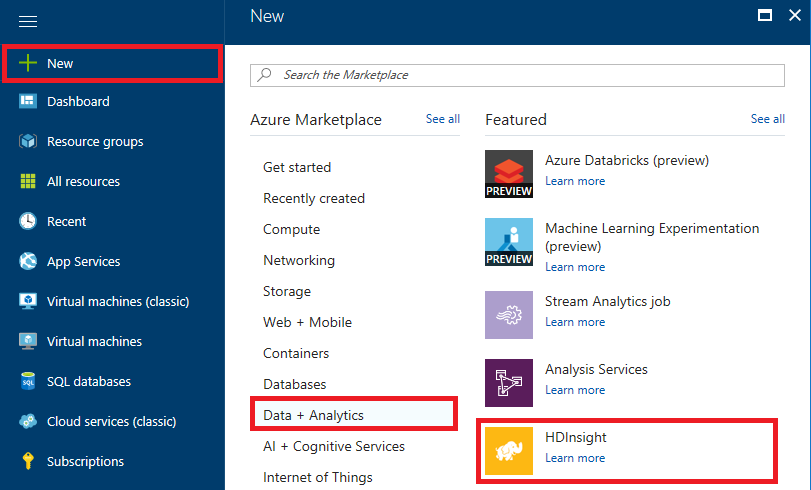

    _Creating an HDInsight cluster_

1. In the "Basics" blade, enter a unique DNS name for the cluster and make sure a green check mark appears next to it indicating that the name is valid and unique. Enter a password and be sure to *remember what you entered*. Place the cluster in the "mmlsparklab-rg" resource group and select **South Central US** as the location. Then click **Cluster type** to open a "Cluster configuration" blade.

	In the "Cluster configuration" blade, select **Spark** as the cluster type and accept the default Spark version on the right. Then click the **Select** button at the bottom of the blade, followed by the **Next** button at the bottom of the "Basics" blade

    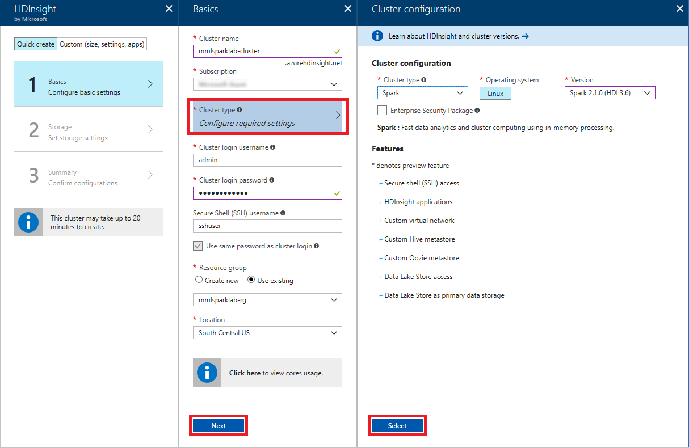

    _Entering cluster settings_

1. Make sure **Primary storage type** is set to **Azure Storage** and **Selection method** is set to **My subscriptions**. Then select the storage account you created in the previous lab. Type "mmlsparklab-cluster" into the **Default container** box, and then click **Next**.

	> The storage account associated with the cluster contains the cluster's file system and the software installed in it.

    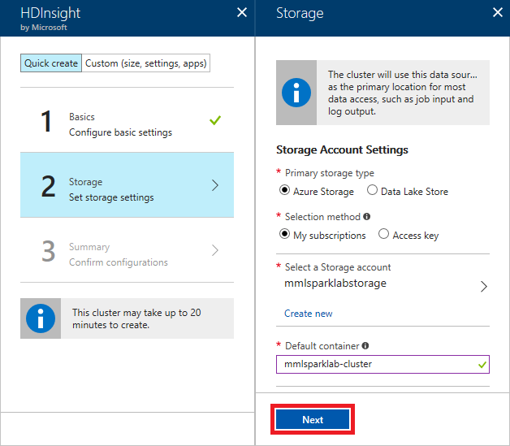

    _Entering cluster-storage settings_

1. Review the cluster settings and make sure everything is correct. Then click **Create** to begin deploying the cluster.

	> By accepting the defaults, you are deploying a cluster that contains two head nodes and four worker nodes. The head nodes each contain four cores and 28 GB of RAM, while the worker nodes each contain eight cores and 56 GB of RAM. If you would like to change the number of nodes or the sizes of the nodes, you may do so by clicking the **Edit** link next to **Cluster size** before clicking **Create**. 

1. Deploying an HDInsight cluster can take 15 minutes or more. Open the "mmlsparklab-rg" resource group in the portal. Wait until "Deploying" changes to "Succeeded," indicating that the cluster has been deployed. Periodically click **Refresh** at the top of the blade to refresh the deployment status.

    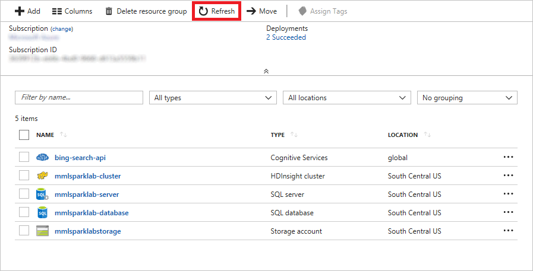

    _Deployment completed_

In this exercise, you provisioned an HDInsight Spark cluster on Azure. But before you can use it to train a machine-learning model, the cluster requires some additional configuration. 

<a name="Exercise2"></a>
## Exercise 2: Add MMLSpark and CNTK to the cluster ##

MMLSpark is the generally recommended package for running CNTK since CNTK and OpenCV are already included (and used in this lab).  At present, the MMLSpark distribution does not have the latest CNTK version, which we will need to run batch normalization training on a CPU (only GPU works in earlier CNTK versions).  Never fear:  we can run an additional script to achieve that goal.

1. To install MMLSpark on an existing [HDInsight Spark
Cluster](https://docs.microsoft.com/en-us/azure/hdinsight/), you can execute a
script action on the cluster head and worker nodes.  For instructions on running
script actions, see [this
guide](https://docs.microsoft.com/en-us/azure/hdinsight/hdinsight-hadoop-customize-cluster-linux#use-a-script-action-during-cluster-creation). The script action url is:
<https://mmlspark.azureedge.net/buildartifacts/0.10/install-mmlspark.sh>.

1. If you're using the Azure Portal to run the script action, go to `Script
actions` → `Submit new` in the `Overview` section of your cluster blade.  In the
`Bash script URI` field, input the script action URL provided above.  Mark the
rest of the options as shown on the screenshot below.

	

	_Submitting a Script Action to install MML Spark_

1. Submit, and the cluster should finish configuring within 10 minutes or so.

1. Next, open a text editor and save a file called ```cntk-install.sh```, and paste in the following code.

    ```bash
    #! /bin/bash

    # Install CNTK on every node. Skip if CNTK latest version is already installed
    CNTK_VER="2.3.1"
    CNTK_BASE_URL="https://cntk.ai/PythonWheel/CPU-Only"
    CNTK_PY27_WHEEL="cntk-$CNTK_VER-cp27-cp27mu-linux_x86_64.whl"
    CNTK_PY35_WHEEL="cntk-$CNTK_VER-cp35-cp35m-linux_x86_64.whl"
    ANACONDA_BASEPATH="/usr/bin/anaconda"

    # Install prerequisites
    sudo apt-get install -y openmpi-bin

    check_version_and_install() {
     CNTK_WHEEL=$1
     FIND_PKG=$(pip freeze | grep cntk)
     if [[ $FIND_PKG == "cntk"* ]]; then
       if [[ $FIND_PKG == *"$CNTK_VER" ]]; then
         echo "CNTK latest version is already installed. Skipping..."
       else
         echo "Updating CNTK..."
         pip install --upgrade --no-deps "$CNTK_BASE_URL/$CNTK_WHEEL"
       fi
     else
       echo "Installing CNTK..."
       pip install "$CNTK_BASE_URL/$CNTK_WHEEL"
     fi
    }

    # Install CNTK in Python 2.7
    source "$ANACONDA_BASEPATH/bin/activate"
    check_version_and_install $CNTK_PY27_WHEEL

    # Install CNTK in Python 3.5
    source "$ANACONDA_BASEPATH/bin/activate" py35
    check_version_and_install $CNTK_PY35_WHEEL

    source "$ANACONDA_BASEPATH/bin/deactivate"

    #Check if script action is running on head node. Exit otehrwise.
    function get_headnodes
    {
        hdfssitepath=/etc/hadoop/conf/hdfs-site.xml
        nn1=$(sed -n '/<name>dfs.namenode.http-address.mycluster.nn1/,/<\/value>/p' $hdfssitepath)
        nn2=$(sed -n '/<name>dfs.namenode.http-address.mycluster.nn2/,/<\/value>/p' $hdfssitepath)

        nn1host=$(sed -n -e 's/.*<value>\(.*\)<\/value>.*/\1/p' <<< $nn1 | cut -d ':' -f 1)
        nn2host=$(sed -n -e 's/.*<value>\(.*\)<\/value>.*/\1/p' <<< $nn2 | cut -d ':' -f 1)

        nn1hostnumber=$(sed -n -e 's/hn\(.*\)-.*/\1/p' <<< $nn1host)
        nn2hostnumber=$(sed -n -e 's/hn\(.*\)-.*/\1/p' <<< $nn2host)

        #only if both headnode hostnames could be retrieved, hostnames will be returned
        #else nothing is returned
        if [[ ! -z $nn1host && ! -z $nn2host ]]
        then
            if (( $nn1hostnumber < $nn2hostnumber )); then
                            echo "$nn1host,$nn2host"
            else
                            echo "$nn2host,$nn1host"
            fi
        fi
    }

    function get_primary_headnode
    {
            headnodes=`get_headnodes`
            echo "`(echo $headnodes | cut -d ',' -f 1)`"
    }

    PRIMARYHEADNODE=`get_primary_headnode`
    fullHostName=$(hostname -f)
    if [ "${fullHostName,,}" != "${PRIMARYHEADNODE,,}" ]; then
        echo "$fullHostName is not primary headnode. Skipping ambari config..."
        exit 0
    fi

    #Constants needed for changing ambari configs
    ACTIVEAMBARIHOST=headnodehost
    PORT=8080
    USERID=$(echo -e "import hdinsight_common.Constants as Constants\nprint Constants.AMBARI_WATCHDOG_USERNAME" | python)
    PASSWD=$(echo -e "import hdinsight_common.ClusterManifestParser as ClusterManifestParser\nimport hdinsight_common.Constants as Constants\nimport base64\nbase64pwd = ClusterManifestParser.parse_local_manifest().ambari_users.usersmap[Constants.AMBARI_WATCHDOG_USERNAME].password\nprint base64.b64decode(base64pwd)" | python)
    CLUSTERNAME=$(echo -e "import hdinsight_common.ClusterManifestParser as ClusterManifestParser\nprint ClusterManifestParser.parse_local_manifest().deployment.cluster_name" | python)

    # Stop and restart affected services
    stopServiceViaRest() {
     if [ -z "$1" ]; then
       echo "Need service name to stop service"
       exit 136
     fi
     SERVICENAME=$1
     echo "Stopping $SERVICENAME"
     curl -u "$USERID:$PASSWD" -i -H "X-Requested-By: ambari" -X PUT -d '{"RequestInfo": {"context" :"Stopping Service '"$SERVICENAME"' to install cntk"}, "Body": {"ServiceInfo": {"state": "INSTALLED"}}}' "http://$ACTIVEAMBARIHOST:$PORT/api/v1/clusters/$CLUSTERNAME/services/$SERVICENAME"
    }

    startServiceViaRest() {
      if [ -z "$1" ]; then
        echo "Need service name to start service"
        exit 136
      fi
      sleep 2
      SERVICENAME="$1"
      echo "Starting $SERVICENAME"
      startResult="$(curl -u $USERID:$PASSWD -i -H 'X-Requested-By: ambari' -X PUT -d '{"RequestInfo": {"context" :"Starting Service '"$SERVICENAME"' with cntk"}, "Body": {"ServiceInfo": {"state": "STARTED"}}}' http://$ACTIVEAMBARIHOST:$PORT/api/v1/clusters/$CLUSTERNAME/services/$SERVICENAME)"
      if [[ "$startResult" == *"500 Server Error"* || "$startResult" == *"internal system exception occurred"* ]]; then
        sleep 60
        echo "Retry starting $SERVICENAME"
        startResult="$(curl -u "$USERID:$PASSWD" -i -H "X-Requested-By: ambari" -X PUT -d '{"RequestInfo": {"context" :"Starting Service '"$SERVICENAME"' with cntk"}, "Body": {"ServiceInfo": {"state": "STARTED"}}}' http://$ACTIVEAMBARIHOST:$PORT/api/v1/clusters/$CLUSTERNAME/services/$SERVICENAME)"
      fi
      echo "$startResult"
    }

    # Stop affected services service
    stopServiceViaRest LIVY
    stopServiceViaRest JUPYTER

    # Start affected services
    startServiceViaRest LIVY
    startServiceViaRest JUPYTER
    ```

1. Using the Azure web portal, upload this file into the ```images``` container created in lab two.

	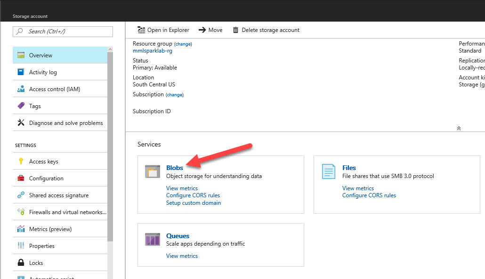

	_Select Blobs in the Azure web portal_

	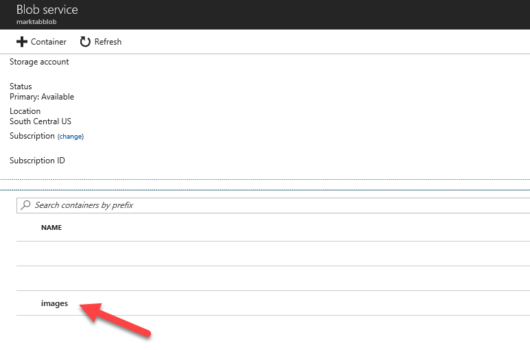

	_Choose the container for uploading images_

	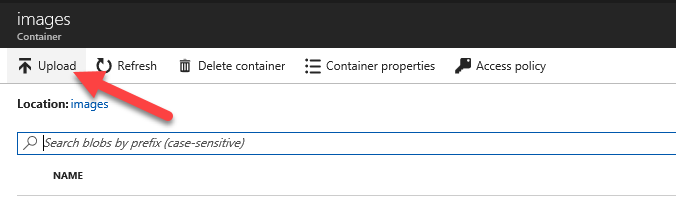

	_Upload the script into the container for uploading images_

	

	_Upload the script (as a **block blob**)_

1. Once uploaded, then obtain the name of the script.  Tap the name of the script to open the **properties** window, and then press the copy icon to save the URL of the script.  

	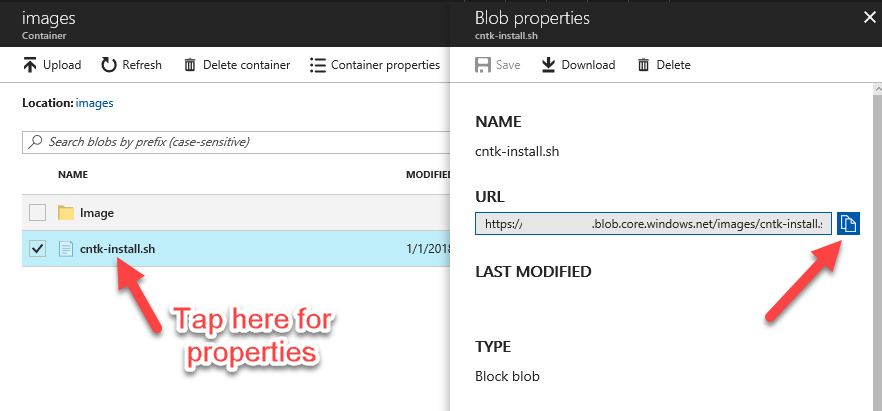

	_Copy URL for the script_

1. Similar to the MML Spark installation, run a Script Action for installing CNTK.

	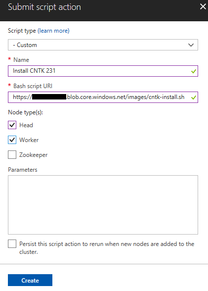

	_Installing CNTK 2.3.1 to the HDInsight Spark Cluster_

1. The CNTK install script stops and starts the Jupyter and Livy services.  You will need those services running before proceeding, and sometimes it's a few moments after the interface shows that the script has completed.  To see the status of these services (and to start them manually if necessary), naviagate to <HDINSIGHT CLUSTERNAME>.azurehdinsight.net to see the status.  The dashboard should look similar to this screenshot.

	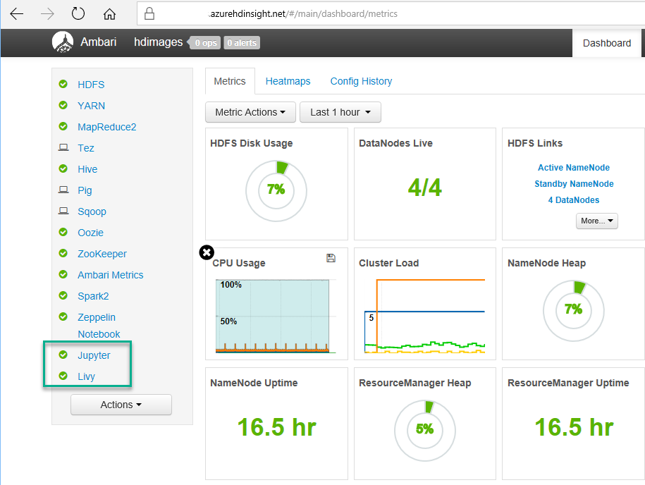

	_Monitoring the HDInsight Spark cluster using Ambari_

In this section, we used the script actions to customize the HDInsight Spark cluster.  Having performed this task, we are ready to run Spark to analyze our imaages with CNTK deep learning.

<a name="Exercise3"></a>
## Exercise 3: Use a Jupyter notebook to run Transfer Learning ##

Jupyter notebooks are increasing a recommended way for data scientists to perform development, such as model building.  Individual notebooks may be saved, uploaded to another Jupyter installation; also, a notebook may be downloaded or printed or saved in other printable formats.  This task of building a deep learning model is appropriate for this task, and in this lab you will end up with a **model** file, which could be subsequently put into production.

1. We have already prepared a Jupyter notebook for this lab.  You will need to upload this notebook to the appropriate location using Jupyter.  Navigate to the HDInsight cluster, and you will see the **Cluster dashboard** option.

	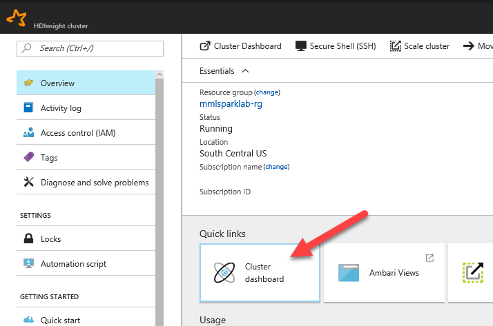

	_Choose cluster dashboard_

1. Choose Jupyter Notebook:  you may be asked to enter your HDInsight user id and password if you have not logged in.  *If you make a mistake on the username or password, you will see an error screen:  our best recommendation is to clear the web cache and open the window again.**

	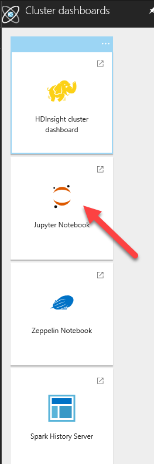

	_Open Jupyter_

1. As mentioned, Jupyter is already running (as we know from the Ambari dashboard):  what we are doing is simply navigating to the top level of the notebook hierarchy.  Then choose, **Upload** and select the notebook named "Painting+Image+Recognition+with+Deep+Transfer+Learning.ipynb" in the **Resources** folder for this lab (Jupyter replaces spaces with the **+** character when downloading).

	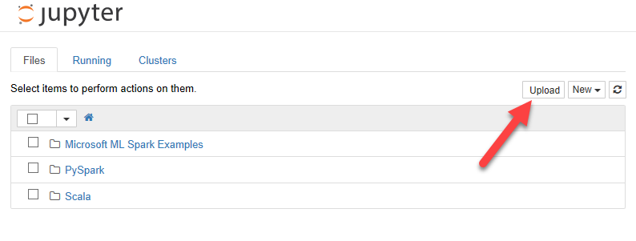

	_Choosing to Upload a Jupyter notebook_

1. You may then open the notebook.  We recommend running the cells indivdiually as you are reading the text in the Jupyter notebook:  you may choose to **Run All** but please read through the text so that you can understand what deep learning is accomplishing.  Many comments also appear in the code allowing you to modify this template for other purposes later.

	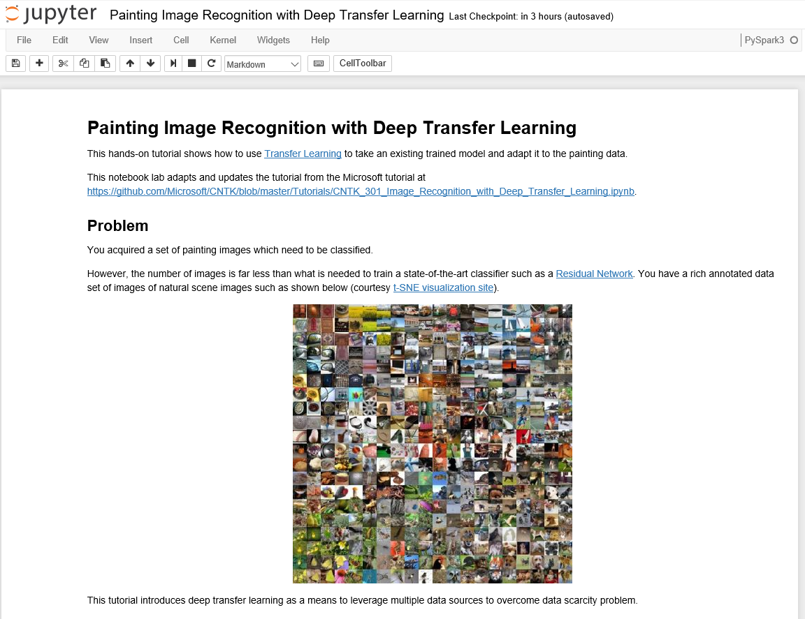

	_Screenshot of the Jupyter notebook_

1.  For this lab, we used a Jupyter notebook originally written for virtual machines.  We made adaptations for a workflow which includes Azure Blob Storage.  The original tutorial only worked with GPU, but CNTK 2.3.1 allows transfer learning to work on CPUs (the only configuraion currently on HDInsight Spark).   Also, we added some code improvements:  for example, the following intermittent code error called for adding **.convert(RGBA)** when opening an image.  In practice, you may have to make modifications to this code as module APIs and hardware features evolve.

	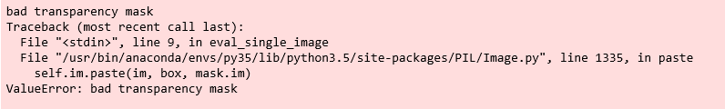

	_Transparency Mask Error (Resolved)_

1. The Jupyter notebook includes some choices for rerunning the deep learning:  try setting the **isFast** flag to **False** and allowing more epochs.  After changing the code, you will need to run that single cell, which you may do on the icon toolbar.  On our runs, we noticed that simply rerunning a model with the same hyperparameter settings would produce slightly different accuracy results.  Again, a cross-validation approach would be best to assure one of the reliability of the results.  

	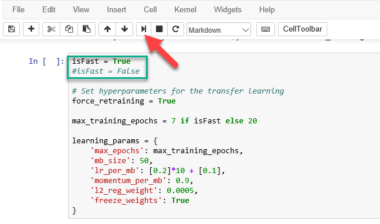

	_Running a single cell_

In this exercise, we took the images selected from Azure ML Workbench, and applied CNTK 2.3.1 using HDInsight Spark on Linux.  The final technique of Transfer Learning is one of the active areas of both application and research.  

<a name="Summary"></a>
## Summary ##

CNTK Deep Learning may be accomplished through using HDInsight Spark.  In this lab, you saw how to upload and update the Python available using custom scripts.  Also, using Jupyter and Azure Blob Storage, you have tools to scale this concept to much larger projects than this lab.  In the next lab, we next turn to visualization.

---

Copyright 2018 Microsoft Corporation. All rights reserved. Except where otherwise noted, these materials are licensed under the terms of the MIT License. You may use them according to the license as is most appropriate for your project. The terms of this license can be found at https://opensource.org/licenses/MIT.
