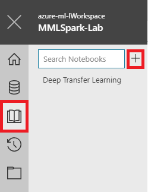
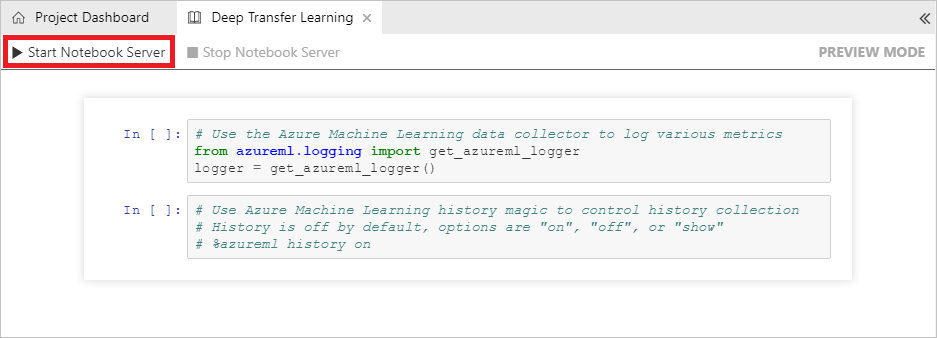
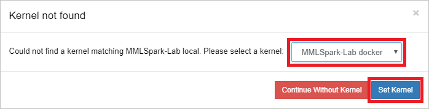
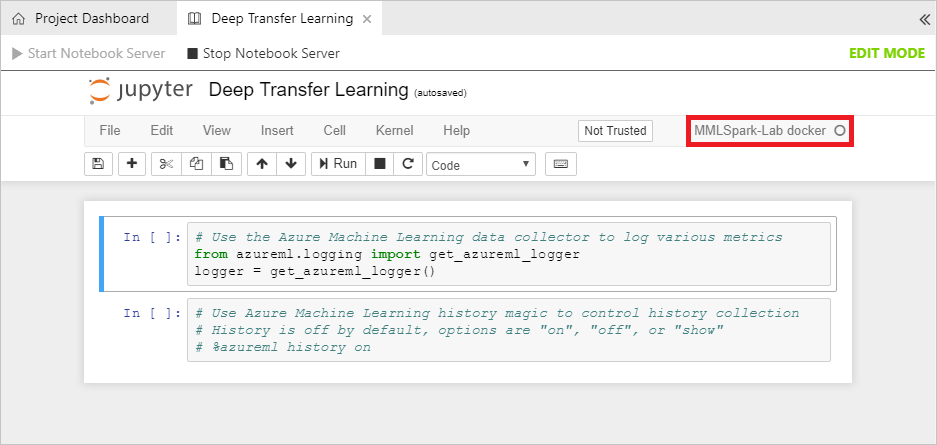
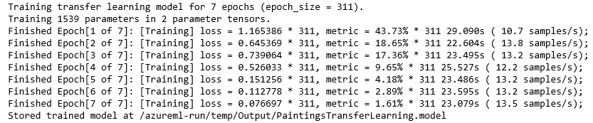
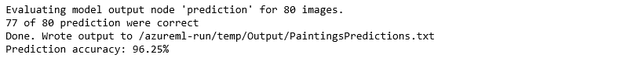

In the [previous lab](../2%20-%20Process), you uploaded a collection of images depicting paintings by three famous artists to Azure blob storage. The images were discovered using [Bing Image Search](https://azure.microsoft.com/services/cognitive-services/bing-image-search-api/), and images that were similar to one another were identified using [perceptual image hashes](https://www.pyimagesearch.com/2017/11/27/image-hashing-opencv-python/) and removed from the dataset. The Python code that uploaded the images to blob storage put them into separate folders for training and testing.

In this lab, you will use these images to train and test a machine-learning model that can identify the artist of a painting by Picasso, Monet, or Van Gogh. The model will be built with the [Microsoft Cognitive Toolkit](https://www.microsoft.com/cognitive-toolkit/), also known as CNTK, and the [Microsoft Machine Learning Library for Apache Spark](https://github.com/Azure/mmlspark) (MMLSpark), which simplifies machine learning by abstracting many of Spark ML's lower-level APIs and providing near-seamless integration with the Cognitive Toolkit and other deep-learning libraries.


<a name="Objectives"></a>
### Objectives ###

In this hands-on lab, you will learn how to:

- Add a Jupyter notebook to an Azure Machine Learning Workbench project
- Use a Jupyter notebook to train a neural network
- Download a file from a Docker container to the local machine

<a name="Prerequisites"></a>
### Prerequisites ###

The following are required to complete this hands-on lab:

- An active Microsoft Azure subscription. If you don't have one, [sign up for a free trial](http://aka.ms/WATK-FreeTrial).
- A computer running Windows 10, Windows Server 2016, macOS Sierra, or macOS High Sierra
- [Azure Machine Learning Workbench](https://docs.microsoft.com/en-us/azure/machine-learning/preview/quickstart-installation)
- The [Azure CLI](https://docs.microsoft.com/cli/azure/install-azure-cli)
- [Docker](https://www.docker.com/)

If you haven't completed the [previous lab in this series](../2%20-%20Process), you must do so before starting this lab.

---

<a name="Exercises"></a>
## Exercises ##

This hands-on lab includes the following exercises:

- [Exercise 1: Create a Jupyter notebook](#Exercise1)
- [Exercise 2: Use the notebook to train a model](#Exercise2)
- [Exercise 3: Download the model file](#Exercise3)

Estimated time to complete this lab: **60** minutes.

<a name="Exercise1"></a>
## Exercise 1: Create a Jupyter notebook ##

In this exercise, you will add a Jupyter notebook to the project that you created in Azure Machine Learning Workbench in [Lab 1](../1%20-%20Ingest), and you will configure the notebook to run in a Docker container using the same Docker image that you used to execute Python code in previous labs.

1. Open the "MMLSpark-Lab" project that you created in [Lab 1](../1%20-%20Ingest) in Azure Machine Learning Workbench. Click the notebook icon in the ribbon on the left, and then click the **+** sign and add a notebook named "Deep Transfer Learning" to the project.

	

	_Adding a notebook_

1. Click **Start Notebook Server** to launch the notebook server process.

	

	_Starting the notebook server_

1. In the "Kernel not found" dialog, select **MMLSpark-Lab docker** from the drop-down list and click **Set Kernel**.

	

	_Selecting a notebook kernel_

	It is important that you select the Docker kernel and not the local kernel so the code you add to the notebook will execute in a Docker container that includes the same dependencies as the Docker containers you used in previous labs. 

1. Once the notebook starts, confirm that the kernel being used is **MMLSpark-Lab docker**, as shown below. If it is not, use the **Kernel** > **Change Kernel** command to change to the **MMLSpark-Lab docker** kernel.

	

	_Confirming that the Docker kernel is being used_

The notebook is now configured and ready to go. Let's use to train a machine-learning model.

<a name="Exercise2"></a>
## Exercise 2: Use the notebook to train a model ##

In this exercise, you will run a script to install MMLSpark on the HDInsight cluster you created in the previous exercise. Then you will run another script to install the latest version of CNTK on the cluster. The version that comes with MMLSpark currently requires VMs with GPUs. The version that you will install works with or without GPUs.

1. Add a cell to the notebook and enter the following Python code. Then press **Ctrl+Enter** to execute it.

	```python
	import glob
	import os
	import sys
	import time
	from PIL import Image
	import numpy as np
	
	try: 
	    from urllib.request import urlretrieve 
	except ImportError: 
	    from urllib import urlretrieve
	
	import requests
	from pathlib import Path
	from azure.storage.blob import BlockBlobService
	import cntk as C
	
	from pyspark.sql import SparkSession
	spark = SparkSession.builder.getOrCreate()

	force_retraining = True
	max_training_epochs = 7
	
	learning_params = {
	    'max_epochs': max_training_epochs,
	    'mb_size': 50,
	    'lr_per_mb': [0.2]*10 + [0.1],
	    'momentum_per_mb': 0.9,
	    'l2_reg_weight': 0.0005,
	    'freeze_weights': True
	}
	```

	This code imports the Python packages that will be used in the notebook, creates a Spark session that can be used to execute [PySpark](https://spark.apache.org/docs/0.9.0/python-programming-guide.html) commands in the container, and initializes the parameters that will be used to train the model. One of those parameters — ```max_epochs``` — determines how many forward and backward passes are made through the model as it is being trained. Setting this value to something higher than 7 could increase the accuracy of the model, but would also increase the training time. 

1. Add a cell to the notebook. Then enter and execute the following code to create a pair of directories in the container's file system if those directories don't already exist — one to hold the images used to train and test the model, and one to hold output:

	```python
	data_root = os.path.abspath(os.path.join('..', 'Image'))
	datasets_path = os.path.join(data_root, 'DataSets')
	output_path = os.path.abspath(os.path.join('.', 'temp', 'Output'))
	
	def ensure_exists(path):
	    if not os.path.exists(path):
	        print('Making Directory: ', path)
	        os.makedirs(path)
	        
	def download_unless_exists(url, filename, max_retries=3):
	    if os.path.exists(filename):
	        print('Reusing locally cached: ', filename)
	    else:
	        print('Starting retrieval of {} to {}'.format(url, filename))
	        retry_cnt = 0
	        while True:
	            try:
	                urlretrieve(url, filename)
	                print('File retrieval completed.')
	                return
	            except:
	                retry_cnt += 1
	                if retry_cnt == max_retries:
	                    print('Exceeded maximum retry count, aborting.')
	                    raise
	                print('Failed to retrieve, retrying.')
	                time.sleep(np.random.randint(1,10))        
	
	ensure_exists(datasets_path)
	ensure_exists(output_path)
	print ('datasets_path: ', Path(datasets_path).resolve())
	print ('output_path: ', Path(output_path).resolve())
	```

	Confirm that the two ```print``` statements at the end produce the following output:

	```
	datasets_path:  /Image/DataSets
	output_path:  /azureml-run/temp/Output
	```

1. The next step is to copy the images that were downloaded from the Web and uploaded to blob storage in the [previous lab](../2%20-%20Process) to the file system inside the Docker container. To that end, paste the following code into a new notebook cell, replace ACCOUNT_NAME on line 1 with the name of the storage account that you created in Lab 2, and execute the code:

	> Note the ```wasbs``` protocol prefix in line 1. In a Spark container, blob storage is mapped to the Hadoop Distributed File System (HDFS) so blobs can be accessed using the same APIs used to access files in the local file system. ```wasbs``` is the protocol prefix used to leverage this mapping.

	```python
	azure_blob_root = 'wasbs://images@ACCOUNT_NAME.blob.core.windows.net/'
	paintings_stem = 'Image/DataSets/Paintings/'
	training_stem = paintings_stem + 'Train/'
	testing_stem = paintings_stem + 'Test/'
	
	# Transfer image files from Azure blob storage into the file system
	def transfer_paintings_dataset(dataset_root = os.path.join(datasets_path, 'Paintings')):
	    training_dir = os.path.join(dataset_root, 'Train')
	    testing_dir = os.path.join(dataset_root, 'Test')
	    
	    # Make directories if needed
	    ensure_exists(dataset_root)
	    ensure_exists(training_dir)
	    ensure_exists(testing_dir)    
	    
		# Transfer the blobs
	    transferfilelocation = azure_blob_root + paintings_stem + 'transferimages.txt'
	    transferfile = spark.sparkContext.textFile(transferfilelocation)

	    for row in transferfile.collect():
	        uri = str(row.split(' ', 1)[0])
	        dirname = os.path.join(dataset_root, str(row.split(' ', 2)[1]))
	        filename = os.path.join(dataset_root, str(row.split(' ', 2)[1]), str(row.split(' ', 2)[2]))
	        
	        ensure_exists(dirname)
	        download_unless_exists(uri, filename) 

	    print (len(transferfile.collect()),' Images Transferred')        

	    return {
	        'training_folder': training_dir,
	        'testing_folder': testing_dir
	    }
	
	print('Transferring paintings from blob storage. This might take a few minutes...')
	paintings_data = transfer_paintings_dataset()
	print('Blobs transferred')
	```

	The transfer might take a few minutes to finish since a few hundred images are being copied from blob storage to the container's file system. Wait for "Blobs transferred" to appear in the output indicating that the transfer is complete before proceesing to the next step.

1. Rather than build an image-classification model from scratch, you will use [transfer learning](https://en.wikipedia.org/wiki/Transfer_learning) to refine a model that has already been trained to work with images. The pretrained model you will use is a Convolution Deep Neural Network (DNN) named [ResNet_18](https://docs.microsoft.com/en-us/cognitive-toolkit/build-your-own-image-classifier-using-transfer-learning) that is provided with the [Microsoft Cognitive Toolkit](https://www.microsoft.com/cognitive-toolkit/), also known as CNTK. Building on a model that is already trained to understand an application domain — in this case, images — allows you to achieve higher accuracy with less training. Training an image classifier from scratch typically requires tens of thousands of images. Refining a pretrained model to differentiate between images can require as few as 10 to 20 images.

	ResNet_18 comes in the form of a .model file that can be downloaded from the CNTK Web site. Add a new cell to the notebook and execute the following code to download the pretrained model:

	```python
	def download_model(model_root = os.path.join(data_root, 'PretrainedModels')):
	    ensure_exists(model_root)
	    resnet18_model_uri = 'https://www.cntk.ai/Models/ResNet/ResNet_18.model'
	    resnet18_model_local = os.path.join(model_root, 'ResNet_18.model')
	    download_unless_exists(resnet18_model_uri, resnet18_model_local)
	    print('Downloaded model to: ', Path(resnet18_model_local).resolve())
	    return resnet18_model_local
	
	print('Downloading pretrained model. This might take a few minutes...')
	base_model_file = download_model()
	print('Download complete')
	```

	This, too, might take a few minutes, depending on your connection speed. Wait for "Download complete" to appear in the output indicating that the download is complete before proceeding to the next step.

1. tk.

	```python
	python_version = sys.version_info.major
	import cntk.io.transforms as xforms
	ensure_exists(output_path)
	np.random.seed(123)
	
	# Creates a minibatch source for training or testing
	def create_mb_source(map_file, image_dims, num_classes, randomize=True):
	    transforms = [xforms.scale(width=image_dims[2], height=image_dims[1], channels=image_dims[0], interpolations='linear')]

	    return C.io.MinibatchSource(C.io.ImageDeserializer(map_file, C.io.StreamDefs(
	        features=C.io.StreamDef(field='image', transforms=transforms),
	        labels=C.io.StreamDef(field='label', shape=num_classes))),
	        randomize=randomize)
	
	# Creates the network model for transfer learning
	def create_model(model_details, num_classes, input_features, new_prediction_node_name='prediction', freeze=False):
	    # Load the pretrained classification net and find nodes
	    base_model = C.load_model(model_details['model_file'])
	    feature_node = C.logging.find_by_name(base_model, model_details['feature_node_name'])
	    last_node = C.logging.find_by_name(base_model, model_details['last_hidden_node_name'])
	
	    # Clone the desired layers with fixed weights
	    cloned_layers = C.combine([last_node.owner]).clone(
	        C.CloneMethod.freeze if freeze else C.CloneMethod.clone,
	        {feature_node: C.placeholder(name='features')})
	
	    # Add new dense layer for class prediction
	    feat_norm = input_features - C.Constant(114)
	    cloned_out = cloned_layers(feat_norm)
	    z = C.layers.Dense(num_classes, activation=None, name=new_prediction_node_name) (cloned_out)
	    return z

	# Trains a transfer learning model
	def train_model(model_details, num_classes, train_map_file,
	                learning_params, max_images=-1):
	    num_epochs = learning_params['max_epochs']
	    epoch_size = sum(1 for line in open(train_map_file))
	    if max_images > 0:
	        epoch_size = min(epoch_size, max_images)
	    minibatch_size = learning_params['mb_size']
	    
	    # Create the minibatch source and input variables
	    minibatch_source = create_mb_source(train_map_file, model_details['image_dims'], num_classes)
	    image_input = C.input_variable(model_details['image_dims'])
	    label_input = C.input_variable(num_classes)
	
	    # Define mapping from reader streams to network inputs
	    input_map = {
	        image_input: minibatch_source['features'],
	        label_input: minibatch_source['labels']
	    }
	
	    # Instantiate the transfer learning model and loss function
	    tl_model = create_model(model_details, num_classes, image_input, freeze=learning_params['freeze_weights'])
	    ce = C.cross_entropy_with_softmax(tl_model, label_input)
	    pe = C.classification_error(tl_model, label_input)
	
	    # Instantiate the trainer object
	    lr_schedule = C.learning_parameter_schedule(learning_params['lr_per_mb'])
	    mm_schedule = C.momentum_schedule(learning_params['momentum_per_mb'])
	    learner = C.momentum_sgd(tl_model.parameters, lr_schedule, mm_schedule, 
	                           l2_regularization_weight=learning_params['l2_reg_weight'])
	    trainer = C.Trainer(tl_model, (ce, pe), learner)
	
	    # Get minibatches of images and perform model training
	    print("Training transfer learning model for {0} epochs (epoch_size = {1}).".format(num_epochs, epoch_size))
	    C.logging.log_number_of_parameters(tl_model)
	    progress_printer = C.logging.ProgressPrinter(tag='Training', num_epochs=num_epochs)

	    for epoch in range(num_epochs):       # loop over epochs
	        sample_count = 0
	        while sample_count < epoch_size:  # loop over minibatches in the epoch
	            data = minibatch_source.next_minibatch(min(minibatch_size, epoch_size - sample_count), input_map=input_map)
	            trainer.train_minibatch(data)                                    # update model with it
	            sample_count += trainer.previous_minibatch_sample_count          # count samples processed so far
	            progress_printer.update_with_trainer(trainer, with_metric=True)  # log progress
	            if sample_count % (100 * minibatch_size) == 0:
	                print ("Processed {0} samples".format(sample_count))
	        progress_printer.epoch_summary(with_metric=True)

	    return tl_model

	def create_map_file_from_folder(root_folder, class_mapping, include_unknown=False, valid_extensions=['.jpg', '.jpeg', '.png']):
	    map_file_name = os.path.join(root_folder, "map.txt")
	    map_file = None
	
	    if python_version == 3: 
	        map_file = open(map_file_name , 'w', encoding='utf-8')
	    else:
	        map_file = open(map_file_name , 'w')
	
	    print(len(class_mapping), ' Total Classes')
	    for class_id in range(0, len(class_mapping)):
	        folder = os.path.abspath(os.path.join(root_folder, class_mapping[class_id]))
	        print(folder)
	        if os.path.exists(folder):
	            print ('path exists')
	            for entry in os.listdir(folder):
	                filename = os.path.abspath(os.path.join(folder, entry))
	                if os.path.isfile(filename) and os.path.splitext(filename)[1].lower() in valid_extensions:
	                    try:
	                        map_file.write("{0}\t{1}\n".format(filename, class_id))
	                    except UnicodeEncodeError:
	                        continue
	
	    if include_unknown:
	        for entry in os.listdir(root_folder):
	            filename = os.path.abspath(os.path.join(root_folder, entry))
	            if os.path.isfile(filename) and os.path.splitext(filename)[1].lower() in valid_extensions:
	                try:
	                    map_file.write("{0}\t-1\n".format(filename))
	                except UnicodeEncodeError:
	                    continue
	                    
	    map_file.close()  
	    return map_file_name
	
	def create_class_mapping_from_folder(root_folder):
	    print(root_folder)
	    print(Path(root_folder).resolve())
	    classes = []
	    for _, directories, _ in os.walk(root_folder):
	        for directory in directories:
	            classes.append(directory)
	            print ('Appending from ', directory)
	    return np.asarray(classes)

	paintings_data['class_mapping'] = create_class_mapping_from_folder(paintings_data['training_folder'])
	paintings_data['training_map'] = create_map_file_from_folder(paintings_data['training_folder'], paintings_data['class_mapping'])
	paintings_data['testing_map'] = create_map_file_from_folder(paintings_data['testing_folder'], paintings_data['class_mapping'], include_unknown=True)

	base_model = {
	    'model_file': base_model_file,
	    'feature_node_name': 'features',
	    'last_hidden_node_name': 'z.x',
	    # Channel Depth x Height x Width
	    'image_dims': (3, 224, 224)
	}

	paintings_model = {
	    'model_file': os.path.join(output_path, 'PaintingsTransferLearning.model'),
	    'results_file': os.path.join(output_path, 'PaintingsPredictions.txt'),
	    'num_classes': len(paintings_data['class_mapping'])
	}
	
	if os.path.exists(paintings_model['model_file']) and not force_retraining:
	    print("Loading existing model from %s" % paintings_model['model_file'])
	    trained_model = C.load_model(paintings_model['model_file'])
	else:
	    trained_model = train_model(base_model, 
	                                paintings_model['num_classes'], paintings_data['training_map'],
	                                learning_params)
	    trained_model.save(paintings_model['model_file'])
	    print("Stored trained model at %s" % paintings_model['model_file'])   
	```

	tk.

	

1. tk.

	```python
	# Evaluates a single image using the re-trained model
	def eval_single_image(loaded_model, image_path, image_dims):
	    # load and format image (resize, RGB -> BGR, CHW -> HWC)
	    try:
	        img = Image.open(image_path).convert("RGBA")
	        
	        if image_path.endswith("png"):
	            temp = Image.new("RGB", img.size, (255, 255, 255))
	            temp.paste(img, img)
	            img = temp
	        resized = img.resize((image_dims[2], image_dims[1]), Image.ANTIALIAS)
	        bgr_image = np.asarray(resized, dtype=np.float32)[..., [2, 1, 0]]
	        hwc_format = np.ascontiguousarray(np.rollaxis(bgr_image, 2))
	
	        # compute model output
	        arguments = {loaded_model.arguments[0]: [hwc_format]}
	        output = loaded_model.eval(arguments)
	
	        # return softmax probabilities
	        sm = C.softmax(output[0])
	        return sm.eval()
	    except FileNotFoundError:
	        print("Could not open (skipping file): ", image_path)
	        return ['None']
	
	# Evaluates an image set using the provided model
	def eval_test_images(loaded_model, output_file, test_map_file, image_dims, max_images=-1, column_offset=0):
	    num_images = sum(1 for line in open(test_map_file))
	    if max_images > 0:
	        num_images = min(num_images, max_images)
	        
	    print("Evaluating model output node '{0}' for {1} images.".format('prediction', num_images))
	
	    pred_count = 0
	    correct_count = 0
	    np.seterr(over='raise')
	    with open(output_file, 'wb') as results_file:
	        with open(test_map_file, "r") as input_file:
	            for line in input_file:
	                tokens = line.rstrip().split('\t')
	                img_file = tokens[0 + column_offset]
	                probs = eval_single_image(loaded_model, img_file, image_dims)
	                
	                if probs[0]=='None':
	                    print("Eval not possible: ", img_file)
	                    continue
	
	                pred_count += 1
	                true_label = int(tokens[1 + column_offset])
	                predicted_label = np.argmax(probs)
	                if predicted_label == true_label:
	                    correct_count += 1
	
	                if pred_count % 100 == 0:
	                    print("Processed {0} samples ({1:.2%} correct)".format(pred_count, 
	                                                                           (float(correct_count) / pred_count)))
	                if pred_count >= num_images:
	                    break
	    print ("{0} of {1} prediction were correct".format(correct_count, pred_count))
	    return correct_count, pred_count, (float(correct_count) / pred_count)
	
	# Evaluate the test set
	predict_correct, predict_total, predict_accuracy = \
	   eval_test_images(trained_model, paintings_model['results_file'], paintings_data['testing_map'], base_model['image_dims'])
	print("Done. Wrote output to %s" % paintings_model['results_file'])

	# Test prediction accuracy
	print ("Prediction accuracy: {0:.2%}".format(float(predict_correct) / predict_total))
	```

	Check the output to determine the model's accuracy in recognizing the artists of the test images presented to it. What is the model's accuracy?

	

TODO: Add closing.

<a name="Exercise3"></a>
## Exercise 3: Download the model file ##

Jupyter notebooks are increasing a recommended way for data scientists to perform development, such as model building.  Individual notebooks may be saved, uploaded to another Jupyter installation; also, a notebook may be downloaded or printed or saved in other printable formats.  This task of building a deep learning model is appropriate for this task, and in this lab you will end up with a **model** file, which could be subsequently put into production.

1. tk.

	```
	docker ps
	```

	Copy container ID to clipboard.

1. tk.

	```
	docker cp CONTAINER_ID:/azureml-run/temp/Output/PaintingsTransferLearning.model C:\Labs
	```

	tk.

1. Verify that the file was coped to the local file system.

TODO: Add closing.

<a name="Summary"></a>
## Summary ##

Now that you have a trained model, the next and final step is to operationalize it and use it in an app that takes images of famous paintings that you input and attempts to identify the artists of those paintings. You may now proceed to the next lab in this series — [Using the Microsoft Machine Learning Library for Apache Spark (MMLSpark) to Perform Image Classification, Part 4](../4%20-%20Visualize) — to put the model into production and write an app that utilizes it.

---

Copyright 2018 Microsoft Corporation. All rights reserved. Except where otherwise noted, these materials are licensed under the terms of the MIT License. You may use them according to the license as is most appropriate for your project. The terms of this license can be found at https://opensource.org/licenses/MIT.
