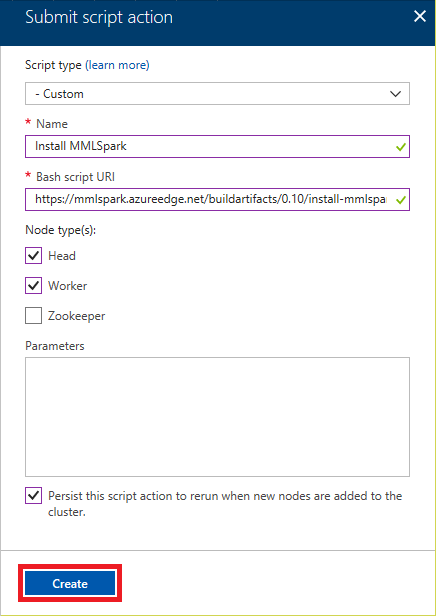
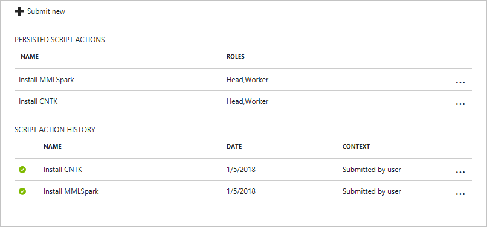
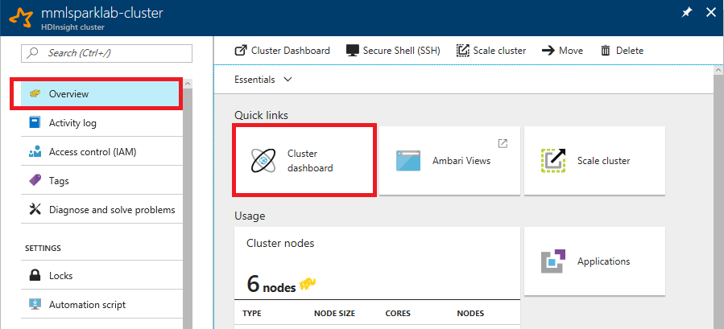
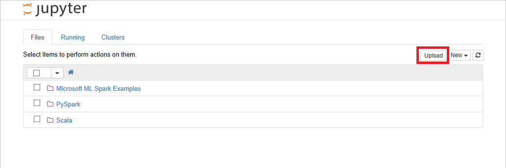

In the [previous lab](../2%20-%20Process), you uploaded a collection of images depicting paintings by three famous artists to Azure blob storage. The images were discovered using [Bing Image Search](https://azure.microsoft.com/services/cognitive-services/bing-image-search-api/), and images that were similar to one another were identified using [perceptual image hashes](https://www.pyimagesearch.com/2017/11/27/image-hashing-opencv-python/) and removed from the dataset. The Python code that uploaded the images to blob storage put them into separate folders for training and testing.

In this lab, you will use these images to train and test a machine-learning model that can identify the artist of a painting by Picasso, Monet, and Van Gogh. The model will be built with the [Microsoft Cognitive Toolkit](https://www.microsoft.com/cognitive-toolkit/), also known as CNTK, and the [Microsoft Machine Learning Library for Apache Spark](https://github.com/Azure/mmlspark) (MMLSpark), which simplifies machine learning by abstracting many of Spark ML's lower-level APIs and providing near-seamless integration with the Cognitive Toolkit and other deep-learning libraries.

Rather than train the model locally on your PC, you will train it on an [Azure HDInsight](https://azure.microsoft.com/services/hdinsight/) Spark cluster. In the real world, training sophisticated machine-learning models frequently requires more computing power than a single PC can provide. With HDInsight, you can spin up high-performance computing (HPC) clusters of any size, with or without GPUs, and use them to process massively large datasets in a fraction of the time required on a single CPU.


<a name="Objectives"></a>
### Objectives ###

In this hands-on lab, you will learn how to:

- Provision an HDInsight Spark Cluster running Spark 2.0
- Customize the HDInsight cluster by adding CNTK and other Python packages
- Move images from Azure blob storage to HDInsight
- Run Transfer Learning using a Jupyter notebook to build a paintings classifier

<a name="Prerequisites"></a>
### Prerequisites ###

The following are required to complete this hands-on lab:

- An active Microsoft Azure subscription. If you don't have one, [sign up for a free trial](http://aka.ms/WATK-FreeTrial).

If you haven't completed the [previous lab in this series](../2%20-%20Process), you must do so before starting this lab.

<a name="Resources"></a>
### Resources ###

[Click here](https://topcs.blob.core.windows.net/public/400-mmlspark-resources-03.zip) to download a zip file containing the resources used in this lab. Copy the contents of the zip file into a folder on your hard disk.

---

<a name="Exercises"></a>
## Exercises ##

This hands-on lab includes the following exercises:

- [Exercise 1: Provision an HDInsight Spark cluster](#Exercise1)
- [Exercise 2: Add MMLSpark and CNTK to the cluster](#Exercise2)
- [Exercise 3: Use a Jupyter notebook to run Transfer Learning](#Exercise3)

Estimated time to complete this lab: **60** minutes.

<a name="Exercise1"></a>
## Exercise 1: Provision an HDInsight Spark cluster ##

In this exercise, you will create an HDInsight cluster provisioned with [Apache Spark](http://spark.apache.org/). Spark is renowned for its versatility and is built for speed, performing some operations on large datasets 100 times faster than Hadoop. It also supports [Spark ML](http://spark.apache.org/docs/latest/ml-guide.html), which provides a DataFrame-based API for building machine-learning models.

1. Open the [Azure Portal](https://portal.azure.com) in your browser. If asked to log in, do so using your Microsoft account.

1. Click **+ New** in the upper-left corner of the portal. Then click **Data + Analytics**, followed by **HDInsight**.

    

    _Creating an HDInsight cluster_

1. In the "Basics" blade, enter a unique DNS name for the cluster and make sure a green check mark appears next to it indicating that the name is valid and unique. Enter a password and be sure to *remember what you entered*. Place the cluster in the "mmlsparklab-rg" resource group and select **South Central US** as the location. Then click **Cluster type** to open a "Cluster configuration" blade.

	In the "Cluster configuration" blade, select **Spark** as the cluster type and accept the default Spark version on the right. Then click the **Select** button at the bottom of the blade, followed by the **Next** button at the bottom of the "Basics" blade

    

    _Entering cluster settings_

1. Make sure **Primary storage type** is set to **Azure Storage** and **Selection method** is set to **My subscriptions**. Then select the storage account you created in the previous lab. Type "mmlsparklab-cluster" into the **Default container** box, and then click **Next**.

	> The storage account associated with the cluster contains the cluster's file system and the software installed in it.

    

    _Entering cluster-storage settings_

1. Review the cluster settings and make sure everything is correct. Then click **Create** to begin deploying the cluster.

	> By accepting the defaults, you are deploying a cluster that contains two head nodes and four worker nodes. The head nodes each contain four cores and 28 GB of RAM, while the worker nodes each contain eight cores and 56 GB of RAM. If you would like to change the number of nodes or the sizes of the nodes, you may do so by clicking the **Edit** link next to **Cluster size** before clicking **Create**. 

1. Deploying an HDInsight cluster can take 15 minutes or more. Open the "mmlsparklab-rg" resource group in the portal. Wait until "Deploying" changes to "Succeeded," indicating that the cluster has been deployed. Periodically click **Refresh** at the top of the blade to refresh the deployment status.

    

    _Deployment completed_

In this exercise, you provisioned an HDInsight Spark cluster on Azure. But before you can use it to train a machine-learning model, the cluster requires some additional configuration. 

<a name="Exercise2"></a>
## Exercise 2: Add MMLSpark and CNTK to the cluster ##

In this exercise, you will run a script to install MMLSpark on the HDInsight cluster you created in the previous exercise. Then you will run another script to install the latest version of CNTK on the cluster. The version that comes with MMLSpark currently requires VMs with GPUs. The version that you will install works with or without GPUs.

1. In the blade for the "mmlsparklab-rg" resource group in the Azure Portal, click the cluster that you created in the previous exercise. Then click **Script actions** in the menu on the left, and click **+ Submit new** at the top of the blade.

1. Select **Custom** as the script type, give the script a name, and paste the following URL into the **Bash script URI** box:

	```
	https://mmlspark.azureedge.net/buildartifacts/0.10/install-mmlspark.sh
	```

	This script installs MMLSpark on the specified nodes in the cluster.

	Check the **Head** and **Worker** boxes to install MMLSpark on the cluster's head nodes and worker nodes. Check the **Perist this script action** box so you can easily rerun the script if you later add nodes to the cluster. Then click the **Create** button. This script typically takes about 5 minutes to run.

	

	_Installing MMLSpark on the cluster_

1. Wait for the script action to finish. (A green check mark will appear next to it under "SCRIPT ACTION HISTORY" when it completes successfully.) Then submit another script action using the following URL:

	```
	https://topcs.blob.core.windows.net/public/install-cntk.sh
	```

	This script installs the CPU-only version of CNTK. Be sure to check the **Head** and **Worker** boxes as you did in the previous step to install CNTK on all the nodes in the cluster.

	

	_Installing CNTK on the cluster_

1. Wait for the script action to finish, and confirm that it completed successfully. (This one, too, usually takes about 5 minutes to run.) Here's what you'll see in the blade for the cluster when both scripts have completed:

	

	_Script actions completed_

1. The CNTK install script stops and starts the cluster's [Jupyter](http://jupyter.org/) and [Livy](https://livy.incubator.apache.org/) services. To make sure these services are up and running, go to the following URL in your browser, substituting your cluster name for CLUSTER_NAME:

	```
	https://CLUSTER_NAME.azurehdinsight.net
	```

1. When prompted, log in with the user name and password you specified in Exercise 1, Step 3. When the cluster's dashboard appears, make sure green check marks appear next to Jupyter and Livy, as shown below.

	

	_Using Ambari to monitor the cluster status_

If Jupyter and Livy aren't checked, wait until they are. The cluster has now been provisioned and configured with the software you need. The next step is to use it to build a machine-learning model.

<a name="Exercise3"></a>
## Exercise 3: Use a Jupyter notebook to run Transfer Learning ##

Jupyter notebooks are increasing a recommended way for data scientists to perform development, such as model building.  Individual notebooks may be saved, uploaded to another Jupyter installation; also, a notebook may be downloaded or printed or saved in other printable formats.  This task of building a deep learning model is appropriate for this task, and in this lab you will end up with a **model** file, which could be subsequently put into production.

1. Return to the cluster in the Azure Portal. Click **Overview** on the left, and then click **Cluster dashboard**.

	

	_Opening the cluster dashboard_

1. In the "Cluster dashboards" blade, click **Jupyter Notebook**. If you are prompted to log in, do so using the user name and password you specified for the cluster in Exercise 1, Step 3.

	> If you enter the wrong password, you may be temporarily locked out of the cluster. If this happens, open an in-private or incognito browser instance, return to the cluster in the Azure Portal, and try again.

1. Click the **Upload** button and upload the notebook file named **Deep Transfer Learning.ipynb**, which is included in the [resources that accompany this lab](https://topcs.blob.core.windows.net/public/400-mmlspark-resources-03.zip).

	

	_Uploading a notebook_

1. Open the notebook that you just uploaded. Then work your way from top to bottom, reading the comments and running each cell one at a time. If you prefer to run the entire notebook all at once, use the **Run All** command in the **Cells** menu.

	

	_Running the Jupyter notebook_

1. Once the final cell is executed, check the output to determine the model's accuracy in recognizing the artists of the test images presented to it. What is the model's accuracy?

One of the code snippets near the top of the notebook defines a variable named ```isFast``` and defaults it to true, which limits the training run to 7 epochs (forward and backward passes through the network). You can set ```isFast``` to false to allow up to 20 epochs and potentially increase the accuracy of the model. Try setting ```isFast``` to false and rerunning the notebook. Does the accuracy change?

<a name="Summary"></a>
## Summary ##

Now that you have a trained model, the next and final step is to operationalize it and use it in an app that takes images of famous paintings that you input and attempts to identify the artists of those paintings. You may now proceed to the next lab in this series — [Using the Microsoft Machine Learning Library for Apache Spark (MMLSpark) to Perform Image Classification, Part 4](../4%20-%20Visualize) — to put the model into production and write an app that utilizes it.

---

Copyright 2018 Microsoft Corporation. All rights reserved. Except where otherwise noted, these materials are licensed under the terms of the MIT License. You may use them according to the license as is most appropriate for your project. The terms of this license can be found at https://opensource.org/licenses/MIT.
