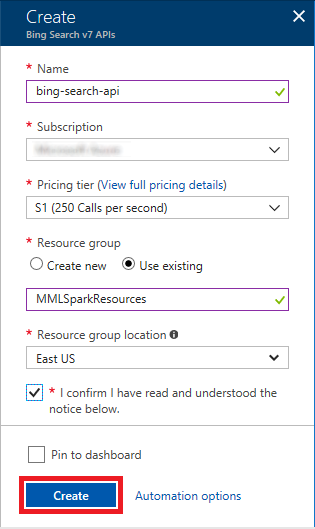
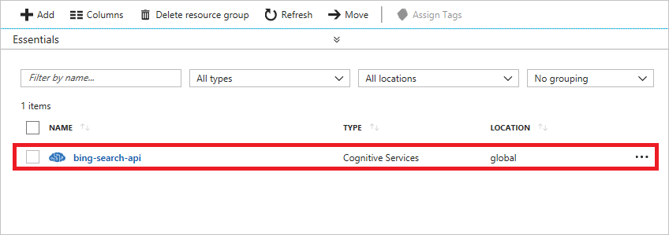
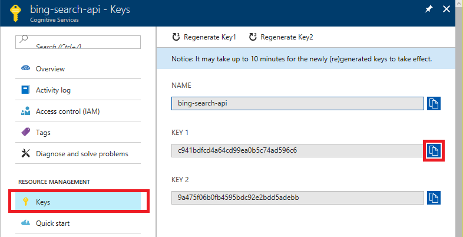
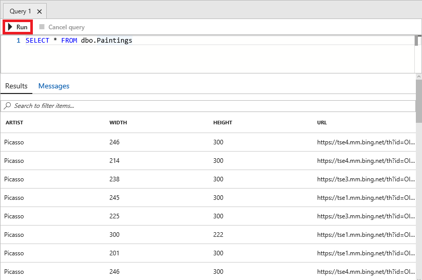

!

Image classification is a common task performed by machine-learning models. Lorem ipsum dolor sit amet, consectetur adipiscing elit. Pellentesque at nulla sit amet nibh finibus volutpat eget id augue. Nunc sit amet rutrum tellus. Proin et aliquet lacus. Donec dignissim, massa quis sagittis imperdiet, enim sem faucibus nibh, in gravida purus dolor non ligula. Maecenas auctor nisl eu felis gravida fermentum. Donec auctor ultrices aliquet. Donec lectus sem, aliquam a consectetur sit amet, ullamcorper eget felis. Fusce condimentum ut odio in pretium. Aliquam dapibus, orci non iaculis pharetra, magna odio mattis massa, sit amet condimentum leo metus ut orci. Etiam maximus nec leo id lobortis. Suspendisse quis est in arcu scelerisque mattis. Fusce a augue consequat lacus suscipit dictum.

In this lab, the first of four in a series, you will use the Azure CLI to create an Azure SQL database in the cloud. Then you will use [Azure Machine Learning Workbench](https://docs.microsoft.com/en-us/azure/machine-learning/preview/quickstart-installation) to run a Python script that uses the [Bing Image Search API](https://azure.microsoft.com/services/cognitive-services/bing-image-search-api/) to search the Web for images of paintings by famous artists and write the results to the Azure SQL database. This is the raw data that you will use to train a machine-learning model in [Lab 3](#) after cleaning and preparing it in [Lab 2](#).


<a name="Objectives"></a>
### Objectives ###

In this hands-on lab, you will learn how to:

- Use the Azure CLI to create an Azure SQL database
- Search the Web for images using Bing Image Search
- Write to an Azure SQL database using Python

<a name="Prerequisites"></a>
### Prerequisites ###

The following are required to complete this hands-on lab:

- An active Microsoft Azure subscription. If you don't have one, [sign up for a free trial](http://aka.ms/WATK-FreeTrial).
- The [Azure CLI](https://docs.microsoft.com/cli/azure/install-azure-cli) version 2.0.19 or higher
- [Azure Machine Learning Workbench](https://docs.microsoft.com/en-us/azure/machine-learning/preview/quickstart-installation)
- [Docker](https://www.docker.com/)

---

<a name="Exercises"></a>
## Exercises ##

This hands-on lab includes the following exercises:

- [Exercise 1: Create an Azure SQL database](#Exercise1)
- [Exercise 2: Get a Bing Search API key](#Exercise2)
- [Exercise 3: Create a Docker container image](#Exercise3)
- [Exercise 4: Populate the database](#Exercise4)
- [Exercise 5: View the contents of the database](#Exercise5)

Estimated time to complete this lab: **30** minutes.

<a name="Exercise1"></a>
## Exercise 1: Create an Azure SQL database ##

In this exercise, you will use the Azure CLI to create an Azure SQL database in the cloud. This database will ultimately serve as a source of data for a machine-learning model that performs image classification. Note that you can also create Azure SQL databases using the [Azure Portal](https://portal.azure.com). Whether to use the CLI or the portal is often a matter of personal preference.

1. If the Azure CLI 2.0 isn't installed on your computer, go to https://docs.microsoft.com/cli/azure/install-azure-cli and install it now. You can determine whether the CLI is installed — and what version is installed — by opening a Command Prompt or terminal window and typing the following command:

	```
	az -v
	```

	If the CLI is installed, the version number will be displayed. If the version number is less than 2.0.19, download and install the latest version.

1. The next task is to create a resource group to hold the database and other Azure resources that you will create in this lab. Execute the following command in a Command Prompt window or terminal window to create a resource group named "mmlsparklab-rg" in Azure's South Central US region:

	```
	az group create --name mmlsparklab-rg --location southcentralus
	```

	> If the CLI responds by saying you must log in to execute this command, type ```az login``` and follow the instructions on the screen to log in to the CLI. In addition, if you have multiple Azure subscriptions, follow the instructions at https://docs.microsoft.com/cli/azure/manage-azure-subscriptions-azure-cli to set the active subscription — the one that the resources you create with the CLI will be billed to.

1. Now use the following command to create a database server in the "mmlsparklab-rg" resource group. Replace SERVER_NAME with the name you wish to assign the database server, and replace ADMIN_USERNAME and ADMIN_PASSWORD with the user name and password for an admin user. **Remember the user name and password** that you enter, because you will need them later.

	```
	az sql server create --name SERVER_NAME --resource-group mmlsparklab-rg --location southcentralus --admin-user ADMIN_USERNAME --admin-password ADMIN_PASSWORD
	```

	> The server name must be unique within Azure, and the admin password must be at least 8 characters long. The user name cannot be one that is reserved in SQL Server such as "admin" or "sa."

1. Use the following command to create a firewall rule that allows the database server to be accessed externally from any IP address. Once more, replace SERVER_NAME with the server name you specified in Step 3.

	```
	az sql server firewall-rule create --resource-group mmlsparklab-rg --server SERVER_NAME -n AllowAll --start-ip-address 0.0.0.0 --end-ip-address 255.255.255.255
	```

	> In practice, you would limit access to your own IP address or a narrow range of IP addresses. To avoid issues with dynamic IP addresses, however, here you are allowing access from any IP address.

1. Use the following command to create a database assigned the [S0 service tier](https://docs.microsoft.com/azure/sql-database/sql-database-service-tiers). Replace DATABASE_NAME with the name you wish to assign the database, and SERVER_NAME with the server name you specified in Step 3.

	```
	az sql db create --resource-group mmlsparklab-rg --server SERVER_NAME --name DATABASE_NAME --service-objective S0
	```

You now have a resource group that contains a database and a database server. If you would like to verify that they were created, open the [Azure Portal](https://portal.azure.com) in your browser, click **Resource groups** in the ribbon on the left side of the portal, and then click the resource group named "mmlsparklab-rg." The resource group should contain two resources, as pictured below. The resource names will differ depending on how you named the database and database server.


_Contents of the "mmlsparklab-rg" resource group_

<a name="Exercise2"></a>
## Exercise 2: Get a Bing Search API key ##

The [Bing Image Search API](https://azure.microsoft.com/services/cognitive-services/bing-image-search-api/) is part of the [Microsoft Cognitive Services](https://azure.microsoft.com/services/cognitive-services/) suite of services and APIs for building intelligent applications. In [Exercise 3](#Exercise3), you will use the Bing Image Search API from a Python script to search the Web for images of paintings by famous artists. But in order to invoke the Bing Image Search API, you need an API key. In this exercise, you will use the Azure Portal to acquire an API key.

1. Open the [Azure Portal](https://portal.azure.com) in your browser. If asked to log in, do so using your Microsoft account.

1. In the Azure Portal, click **+ New**. Type "bing search" (without quotation marks) into the search box and select **Bing Search v7 APIs** from the drop-down list. Then click the **Create** button at the bottom of the ensuing blade.

    

    _Creating a new Bing Search API subscription_

1. Type "bing-search-api" into the **Name** box and select **S1** as the **Pricing tier**. Select the same **Location** that you selected for the database in the previous exercise. Under **Resource group**, select **Use existing** and select the "mmlsparklab-rg" resource group that you created in [Exercise 1](#Exercise1). Check the **I confirm** box, and then click **Create**.

    

    _Subscribing to the Bing Search API_

1. Click **Resource groups** in the ribbon on the left side of the portal, and then click the "mmlsparklab-rg" resource group to view its contents. Now click the Bing Search subscription that you created a moment ago.

    

    _Opening the subscription_

1. Click **Keys** in the menu on the left. Then click the **Copy** button to the right of **KEY 1** to copy the API key to the clipboard.

    

    _Copying the API key_

Finish up by pasting the key that is on the clipboard into your favorite text editor so you can easily retrieve it in [Exercise 4](#Exercise4).

<a name="Exercise3"></a>
## Exercise 3: Create a Docker container image ##

In [Exercise 4](#Exercise4), you will use a Python script to search the Web for images of paintings by famous artists and write the results to the Azure SQL database you created in [Exercise 1](#Exercise1). Connecting to an Azure SQL database from Python requires an environment specially prepared with certain packages and drivers. In this exercise, you will create a custom Docker container image that has those packages and drivers installed. In the next exercise, you will use a container created from this image to host the Python code that connects to the database.

1. Create a directory on your hard disk and name it anything you want. Then add a text file named **Dockerfile** (no file-name extension) to that directory and insert the following statements:

	```
	FROM microsoft/mmlspark:plus-0.9.9
	USER root
	RUN apt-get update && apt-get install -y \
	    curl apt-utils apt-transport-https debconf-utils gcc build-essential g++-5\
	    && rm -rf /var/lib/apt/lists/* && \
		curl https://packages.microsoft.com/keys/microsoft.asc | apt-key add - && \
		curl https://packages.microsoft.com/config/ubuntu/16.04/prod.list > /etc/apt/sources.list.d/mssql-release.list && \
		apt-get update && ACCEPT_EULA=Y apt-get install -y msodbcsql unixodbc-dev && \
		apt-get update && ACCEPT_EULA=Y apt-get install -y mssql-tools && \
		echo 'export PATH="$PATH:/opt/mssql-tools/bin"' >> ~/.bashrc && \
		/bin/bash -c "source ~/.bashrc" && \
		apt-get install -y locales && \
	    echo "en_US.UTF-8 UTF-8" > /etc/locale.gen && \
	    locale-gen && \
		pip install pyodbc
	```

	This **Dockerfile** contains instructions for building a Docker container image. It uses ```microsoft/mmlspark:plus-0.9.9``` as the base image and adds a Python package named ```pyodbc``` that permits Python scripts to access Azure SQL databases (as well as on-premises SQL Server databases). It also installs several packages that ```pyodbc``` depends on.

1. Open a Command Prompt or terminal window and navigate to the directory you created in the previous step (the directory that contains the **Dockerfile**). Then execute the following command to build a custom contained image named ```spark-sql```:

	```
	docker build -t spark-sql .
	```

1. Wait until the command completes (it will probably take a few minutes) and confirm that it completed successfully.

The container image has been created and cached on the local machine. If you would like to be absolutely certain that it was created and cached, execute a ```docker images``` command in the Command Prompt or terminal window and verify that the list of images includes one named ```spark-sql```.

<a name="Exercise4"></a>
## Exercise 4: Populate the database ##

In this exercise, you will use Azure Machine Learning Workbench to write and execute a Python script that uses the Bing Image Search API to find images of paintings by famous artists such as Picasso, Van Gogh, and Monet and record information about the images, including their URLs, in the Azure SQL database that you created in [Exercise 1](#Exercise1).

1. If Azure Machine Learning Workbench isn't installed on your computer, go to https://docs.microsoft.com/azure/machine-learning/preview/quickstart-installation and follow the instructions there to install it, create a Machine Learning Experimentation account, and sign in to Machine Learning Workbench for the first time. The experimentation account is required in order to use Azure Machine Learning Workbench. Stop when you reach the section entitled "Create a new project."

1. Launch Azure Machine Learning Workbench if it isn't already running. Then click the **+** sign in the "Projects" panel and select **New Project**.

	

	_Creating a new project_

1. Enter a project name such as "MMLSpark-Lab" and a project description. For **Project directory**, specify the location where you would like for the project directory to be created. Make sure **Blank Project** is selected as the project type, and then click the **Create** button.

	

	_Creating a new project_

1. tk.

	

	_tk_

1. tk.

	

	_tk_

1. tk.

	

	_tk_

1. tk.

	

	_tk_

1. tk.

	

	_tk_

TODO: Add closing.

<a name="Exercise5"></a>
## Exercise 5: View the contents of the database ##

In this exercise, you will use the Azure Portal to view the information regarding paintings by famous artists that was written to the Azure SQL database by the Python script in the previous exercise.

1. Return to the [Azure Portal](https://portal.azure.com) in your browser and open the "mmlsparklab-rg" resource group that you created in [Exercise 1](#Exercise1). Then click the database that you created in the same exercise.

	

	_Opening the database_

1. Click **Data explorer** in the menu on the left. Then click **Login** at the top of the blade, enter the user name and password you specified in Exercise 1, Step 3, and click **OK** to log in to the database.

	

	_Logging in to the database_

1. Type "SELECT * FROM dbo.Paintings" (without quotation marks) into the query window and click the **Run** button. Confirm that several database rows appear in the results window underneath.

	

	_Running a query_

Scroll down in the results window and examine the data displayed there. The results should include several hundred rows, each containing the URL, width, and height of a painting by Picasso, Van Gogh, or Monet. This is the raw data that you will use to train a machine-learning model in [Lab 3](#) after cleaning and preparing it in [Lab 2](#).

<a name="Summary"></a>
## Summary ##

TODO: Add summary.

---

Copyright 2017 Microsoft Corporation. All rights reserved. Except where otherwise noted, these materials are licensed under the terms of the MIT License. You may use them according to the license as is most appropriate for your project. The terms of this license can be found at https://opensource.org/licenses/MIT.
