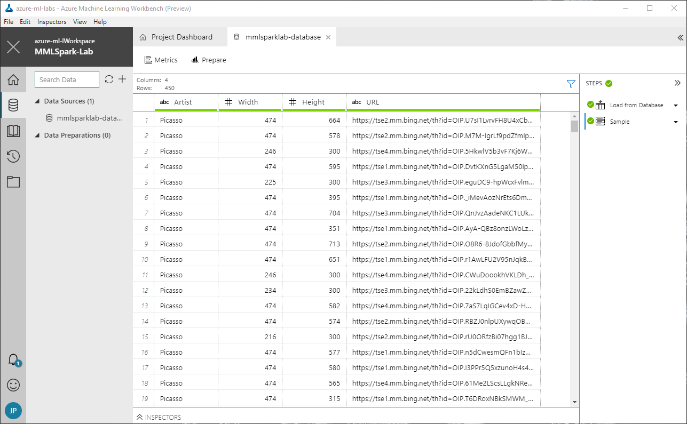

!

Lorem ipsum dolor sit amet, consectetur adipiscing elit. Curabitur malesuada ipsum at nunc suscipit, sed commodo nunc auctor. Fusce in enim dolor. Cras at tortor et lacus aliquet dignissim. Praesent pellentesque laoreet lacinia. Quisque maximus tellus ac lorem mollis rutrum. Ut pharetra convallis molestie. Donec ornare faucibus mi eget dictum. Nulla nec viverra quam. Proin lectus nisi, accumsan vitae nibh at, varius fermentum ipsum. Pellentesque vitae massa velit. Phasellus vel tincidunt quam, ac molestie dolor.
 
Duis eu velit vel odio molestie vestibulum. Class aptent taciti sociosqu ad litora torquent per conubia nostra, per inceptos himenaeos. Quisque id maximus massa, sed rhoncus nisi. Duis sit amet dignissim lorem, a congue ipsum. Suspendisse tellus nibh, porttitor ut blandit eu, pellentesque blandit enim. Pellentesque condimentum nunc vitae suscipit sollicitudin. Fusce tempor dictum elit, non maximus elit condimentum sit amet. Interdum et malesuada fames ac ante ipsum primis in faucibus. Quisque et felis venenatis, vulputate tellus non, consectetur ligula. Vestibulum volutpat ornare mauris, a porttitor tellus ullamcorper sit amet. Vivamus pharetra finibus felis. Sed ut scelerisque tortor. Vivamus dui diam, posuere sed ullamcorper sit amet, lacinia cursus urna. Pellentesque dictum auctor augue, vel consequat dui cursus id.

In this lab, the second of four in a series, you will prepare the data that you generated and stored in an Azure SQL database in the [previous lab](#) so that it can be used to train a machine-learning model that performs image classification. Preparation will involve using a technique called [perceptual image hashing](https://www.pyimagesearch.com/2017/11/27/image-hashing-opencv-python/) to identify images that are identical or highly similar so the model won't be biased by training it with multiple variations of the same image. In the [next lab](#), you will use the images that you generated to train a machine-learning model that recognizes the artists of famous paintings.


<a name="Objectives"></a>
### Objectives ###

In this hands-on lab, you will learn how to:

- Use an Azure SQL database as a data source in Machine Learning Workbench
- Use [OpenCV](https://opencv.org/) to normalize images
- Use perceptual image hashing to identify similar images

<a name="Prerequisites"></a>
### Prerequisites ###

The following are required to complete this hands-on lab:

- An active Microsoft Azure subscription. If you don't have one, [sign up for a free trial](http://aka.ms/WATK-FreeTrial).
- [Azure Machine Learning Workbench](https://docs.microsoft.com/en-us/azure/machine-learning/preview/quickstart-installation)
- [Docker](https://www.docker.com/)

If you haven't completed the [previous lab in this series](#), you must do so before starting this lab.

---

<a name="Exercises"></a>
## Exercises ##

This hands-on lab includes the following exercises:

- [Exercise 1: Connect to Azure SQL from ML Workbench](#Exercise1)
- [Exercise 2: Normalize the images](#Exercise2)
- [Exercise 3: Dedupe the images](#Exercise3)

Estimated time to complete this lab: **40** minutes.

<a name="Exercise1"></a>
## Exercise 1: Connect to Azure SQL from ML Workbench ##

In this exercise, you will connect to the Azure SQL database you created in the previous lab from Azure Machine Learning Workbench by specifying the database as a data source.

1. Open the [Azure Portal](https://portal.azure.com) in your browser. If asked to log in, do so using your Microsoft account.

1. Launch Azure Machine Learning Workbench and open the project that you created in the previous lab. Then click the **Data** icon in the ribbon on the left, click the **+** sign, and select **Add Data Source**.

	

	_Adding a data source_

1. Click **Database**, and then click the **Next** button.

	

	_Adding a database as a data source_

1. In the **Server Address** box, enter "SERVER_NAME.database.windows.net" (without quotation marks), where SERVER_NAME is the name you assigned to the database server in the previous lab. Make sure **Server** is selected as the **Authentication Type**, and enter the admin user name and password that you specified in the previous lab for logging in to the database. In **Database To Connect To**, enter the name you assigned to the database in the previous lab. Then scroll down and enter the following statement into the **Query** box:

	```
	SELECT * FROM dbo.Paintings
	```

	Then finish up by clicking the **Finish** button.

	

	_Adding an Azure SQL database as a data source_

1. Confirm that the contents of the "Paintings" table appears in ML Workbench, complete with columns named "Artist," "Width," "Height," and "URL."

	

	_Data imported from the Azure SQL database_

1. tk.

	

	_tk_

1. tk.

	

	_tk_

1. tk.

	

	_tk_

TODO: Add closing.

<a name="Exercise2"></a>
## Exercise 2: Normalize the images ##

TODO: Add introduction.

1. tk.

	

	_tk_

1. tk.

	

	_tk_

1. tk.

	

	_tk_

1. tk.

	

	_tk_

1. tk.

	

	_tk_

TODO: Add closing.

<a name="Exercise3"></a>
## Exercise 3: Dedupe the images ##

TODO: Add introduction.

1. tk.

	

	_tk_

1. tk.

	

	_tk_

1. tk.

	

	_tk_

1. tk.

	

	_tk_

1. tk.

	

	_tk_

TODO: Add closing.

<a name="Summary"></a>
## Summary ##

TODO: Add summary.

---

Copyright 2017 Microsoft Corporation. All rights reserved. Except where otherwise noted, these materials are licensed under the terms of the MIT License. You may use them according to the license as is most appropriate for your project. The terms of this license can be found at https://opensource.org/licenses/MIT.
