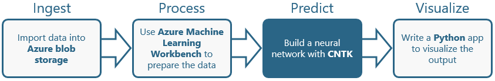

In the [previous lab](#), you used Azure Machine Learning Workbench to execute a Python script that converts raw data from the [MNIST database](http://yann.lecun.com/exdb/mnist/), which contains 60,000 scanned and normalized images of the hand-written digits 0 through 9, into data that can be used to train neural networks built with the [Microsoft Cognitive Toolkit](https://www.microsoft.com/en-us/research/product/cognitive-toolkit/), also known as CNTK. The script ran in a Docker container, received input from Azure blob storage, and wrote its output to Azure blob storage.

In this lab, the third of four in a series, you will return to Machine Learning Workbench and train three machine-learning models that rely on CNTK neural networks. The goal: to find the best model for recognizing hand-written digits with an eye toward operationalizing the model and building a client app that uses it in the next and final lab in this series.



<a name="Objectives"></a>
### Objectives ###

In this hands-on lab, you will learn how to:

- Write Python code to train CNTK models
- Execute that code in Docker containers using Azure Machine Learning Workbench
- Determine the accuracy of a trained CNTK model

<a name="Prerequisites"></a>
### Prerequisites ###

The following are required to complete this hands-on lab:

- An active Microsoft Azure subscription. If you don't have one, [sign up for a free trial](http://aka.ms/WATK-FreeTrial).
- A computer running Windows 10, Windows Server 2016, macOS Sierra, or macOS High Sierra
- [Azure Machine Learning Workbench](https://docs.microsoft.com/en-us/azure/machine-learning/preview/quickstart-installation)
- [Docker](https://www.docker.com/)

If you haven't completed the [previous lab in this series](#), you must do so before starting this lab.

---

<a name="Exercises"></a>
## Exercises ##

This hands-on lab includes the following exercises:

- [Exercise 1: Train a neural network and score it for accuracy](#Exercise1)
- [Exercise 2: Train and score a second neural network](#Exercise2)
- [Exercise 3: Train and score a third neural network](#Exercise3)

Estimated time to complete this lab: **30** minutes.

<a name="Exercise1"></a>
## Exercise 1: Train a neural network and score it for accuracy ##

It's time to leverage the work you performed in the first two labs by using the CNTK-formatted data that you generated to train and test a machine-learning model that utilizes a CNTK neural network. The Microsoft Cognitive Toolkit comes with several [BrainScript](https://docs.microsoft.com/cognitive-toolkit/brainscript-basic-concepts) files enabling various types of neural networks to be trained and tested with a single command. One of the simplest network types is the "One Hidden Layer" network, which is not a deep neural network, but rather one that contains a single layer of hidden nodes. In this exercise, you will write a Python script that trains and scores a "One Hidden Layer" network designed to recognize hand-written digits, and execute the script in a Docker container from Azure Machine Learning Workbench.

1. Return to Machine Learning Workbench and to the project that you created in the previous lab. Then open the file named **train.py** for editing.

	

	_Opening train.py for editing in Machine Learning Workbench_

1. Replace the contents of **train.py** with the Python code below. Then save the file.

	```Python
	from __future__ import print_function
	import os
	from shutil import copyfile
	import mnist_utils as ut
	from azure.storage.blob import (
	    BlockBlobService,
	    ContainerPermissions,
	    BlobPermissions,
	    PublicAccess,
	)
	from datetime import datetime, timedelta
	from subprocess import Popen, PIPE
	import subprocess
	
	print(os.environ['AZ_STORAGE_CONNSTR'])
	block_blob_service = BlockBlobService(connection_string=os.environ['AZ_STORAGE_CONNSTR'])
	
	def trainModel(modelFile):
	    modelDir = "models"
	    modelName = os.path.splitext(modelFile)[0].lower()
	
	    if not os.path.exists(os.path.join('.', modelDir)):
	        os.makedirs(os.path.join('.', modelDir))
	
	    print('Training model ' + modelFile);
	
	    p = Popen(["cntk", "configFile=./" + modelFile], stdout=subprocess.PIPE, stderr=subprocess.PIPE)
	    std_out, std_err = p.communicate()
	    print(std_err.decode("utf-8"))
	    # call(["cntk", "configFile=./cntk/" + modelFile])
	    print('Uploading model ' + modelFile);
	
	    modelContainer = "models" #os.path.splitext(modelFile)[0].lower()
	
	    block_blob_service.create_container(modelContainer, metadata=None, public_access=None, fail_on_exist=False, timeout=None)
	
	    for filename in os.listdir(os.path.join('.', modelDir)):
	        # copyfile('./Output/Models/' + filename, './outputs/Models/' +  modelName  + "/" + filename)
	        block_blob_service.create_blob_from_path(modelContainer, filename, os.path.join('.', modelDir, filename))
	        os.remove(os.path.join('.', modelDir, filename))
	        
	    print ('Done.')
	
	if __name__ == "__main__":
	    container = 'cntk-data'
	    if not os.path.exists(os.path.join('.', 'mnist')):
	        os.makedirs(os.path.join('.', 'mnist'))
	    print('Downloading CNTK data...');
	    block_blob_service.get_blob_to_path(container, 'Train-28x28_cntk_text.txt', r'./mnist/Train-28x28_cntk_text.txt');
	    block_blob_service.get_blob_to_path(container, 'Test-28x28_cntk_text.txt', r'./mnist/Test-28x28_cntk_text.txt');
	    print('Done.');
	
	    trainModel('01-OneHidden.cntk')
	```

	This Python script downloads the CNTK-formatted training and testing files that you created in the previous lab from blob storage and invokes the ```cntk``` command from the Cognitive Toolkit (remember, you are executing code in a Docker container created from a Docker image that contains the Cognitive Toolkit) to train and score a neural network. It passes as input the ```cntk``` command the path to a BrainScript file that, in this case, is named **01-OneHidden.cntk**. The output from the command is a set of binary files that comprise a "compiled" neural network. The Python script above uploads these files to a new container in blob storage.

1. Add a file named **01-OneHidden.cntk** to the project and add the following code. Then save the file.

	```
	# Parameters can be overwritten on the command line
	# for example: cntk configFile=myConfigFile RootDir=../.. 
	# For running from Visual Studio add
	# currentDirectory=$(SolutionDir)/<path to corresponding data folder> 
	
	command = trainNetwork:testNetwork
	
	precision = "float"; traceLevel = 1 ; deviceId = "auto"
	
	rootDir = "." ; dataDir = "./mnist" ;
	outputDir = "./models" ;
	
	modelPath = "$outputDir$/01_OneHidden"
	#stderr = "$outputDir$/01_OneHidden_bs_out"
	
	# TRAINING CONFIG
	trainNetwork = {
	    action = "train"
	    
	    BrainScriptNetworkBuilder = {
	        imageShape = 28:28:1                        # image dimensions, 1 channel only
	        labelDim = 10                               # number of distinct labels
	        featScale = 1/256
	
	        # This model returns multiple nodes as a record, which
	        # can be accessed using .x syntax.
	        model(x) = {
	            s1 = x * featScale
	            h1 = DenseLayer {200, activation=ReLU} (s1) 
	            z = LinearLayer {labelDim} (h1)
	        }
	        
	        # inputs
	        features = Input {imageShape}
	        labels = Input {labelDim}
	
	        # apply model to features
	        out = model (features)
	
	        # loss and error computation
	        ce   = CrossEntropyWithSoftmax (labels, out.z)
	        errs = ClassificationError (labels, out.z)
	
	        # declare special nodes
	        featureNodes    = (features)
	        labelNodes      = (labels)
	        criterionNodes  = (ce)
	        evaluationNodes = (errs)
	        outputNodes     = (out.z)
	        
	        # Alternative, you can use the Sequential keyword and write the model 
	        # as follows. We keep the previous format because EvalClientTest needs 
	        # to access the internal nodes, which is not doable yet with Sequential 
	        #
	        # Scale{f} = x => Constant(f) .* x
	        # model = Sequential (
	            # Scale {featScale} :
	            # DenseLayer {200} : ReLU : 
	            # LinearLayer {labelDim}
	        # )
	
	        # # inputs
	        # features = Input {imageShape}
	        # labels = Input (labelDim)
	
	        # # apply model to features
	        # ol = model (features)
	
	        # # loss and error computation
	        # ce   = CrossEntropyWithSoftmax (labels, ol)
	        # errs = ClassificationError (labels, ol)
	
	        # # declare special nodes
	        # featureNodes    = (features)
	        # labelNodes      = (labels)
	        # criterionNodes  = (ce)
	        # evaluationNodes = (errs)
	        # outputNodes     = (ol)
	    }
	
	    SGD = {
	        epochSize = 60000
	        minibatchSize = 64
	        maxEpochs = 10
	        learningRatesPerSample = 0.01*5:0.005
	        momentumAsTimeConstant = 0
	        
	        numMBsToShowResult = 500
	    }
	
	    reader = {
	        readerType = "CNTKTextFormatReader"
	        # See ../README.md for details on getting the data (Train-28x28_cntk_text.txt).
	        file = "$DataDir$/Train-28x28_cntk_text.txt"
	        input = {
	            features = { dim = 784 ; format = "dense" }
	            labels =   { dim = 10  ; format = "dense" }
	        }
	    }   
	}
	
	# TEST CONFIG
	testNetwork = {
	    action = "test"
	    minibatchSize = 1024    # reduce this if you run out of memory
	
	    reader = {
	        readerType = "CNTKTextFormatReader"
	        file = "$DataDir$/Test-28x28_cntk_text.txt"
	        input = {
	            features = { dim = 784 ; format = "dense" }
	            labels =   { dim = 10  ; format = "dense" }
	        }
	    }
	}
	```

	TODO: Add description.

1. Select **Docker** from the Run Configuration drop-down and **train.py** from the Script drop-down to configure Workbench to run **train.py** in a Docker container. Then click **Run**.

	

	_Training a neural network_

1. Wait for the run to complete and confirm that it completed successfully. It may take a few minutes to complete, and the duration will depend somewhat on your connection speed since the CNTK-formatted data you generated in the previous lab has to be downloaded from blob storage.

	

	_tk_

1. tk.

	

	_tk_

1. tk.

	

	_tk_

1. tk.

	

	_tk_

TODO: Add closing.

<a name="Exercise2"></a>
## Exercise 2: Train and score a second neural network ##

CNTK supports many different types of neural networks. Some are better than others at recognizing hand-written digits. In this exercise, you will train and score a second neural network and compare the results to the one you created in the previous exercise.

1. tk.

	

	_tk_

1. tk.

	

	_tk_

1. tk.

	

	_tk_

1. tk.

	

	_tk_

1. tk.

	

	_tk_

TODO: Add closing.

<a name="Exercise3"></a>
## Exercise 3: Train and score a third neural network ##

In this exercise, you will train and score a third neural network and compare the results to the ones you created in [Exercise 1](#Exercise1) and [Exercise 2](#Exercise2).

1. tk.

	

	_tk_

1. tk.

	

	_tk_

1. tk.

	

	_tk_

1. tk.

	

	_tk_

1. tk.

	

	_tk_

TODO: Add closing.

<a name="Summary"></a>
## Summary ##

TODO: Add summary.

---

Copyright 2017 Microsoft Corporation. All rights reserved. Except where otherwise noted, these materials are licensed under the terms of the MIT License. You may use them according to the license as is most appropriate for your project. The terms of this license can be found at https://opensource.org/licenses/MIT.
