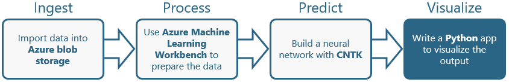

In the [previous lab](#), you used Azure Machine Learning Workbench and the [Microsoft Cognitive Toolkit](https://www.microsoft.com/en-us/research/product/cognitive-toolkit/), also known as CNTK, to train three neural networks to recognize hand-written digits using data from the [MNIST database](http://yann.lecun.com/exdb/mnist/). You also scored the neural networks for accuracy using test data from the same database. The "compiled" networks were written to Azure blob storage.

In this lab, the fourth of four in a series, you will build a Docker image containing one of the compiled networks and expose its functionality through REST calls placed to a [Node.js](https://nodejs.org/en/) Web server running in the container. Then you will write a Node.js app that runs on your local computer and allows users to draw digits. Each digit input by the user will be submitted to the neural network, which will "predict" which digit was drawn, providing a real and tangible demonstration of machine learning in action.



<a name="Objectives"></a>
### Objectives ###

In this hands-on lab, you will learn how to:

- Create a Docker image containing a neural network
- Run the image in a Docker container
- Call the neural network from an app

<a name="Prerequisites"></a>
### Prerequisites ###

The following are required to complete this hands-on lab:

- An active Microsoft Azure subscription. If you don't have one, [sign up for a free trial](http://aka.ms/WATK-FreeTrial).
- [Docker](https://www.docker.com/)
- [Node.js](https://nodejs.org/en/)
- [Visual Studio Code](https://code.visualstudio.com/)

If you haven't completed the [previous lab in this series](#), you must do so before starting this lab.

---

<a name="Exercises"></a>
## Exercises ##

This hands-on lab includes the following exercises:

- [Exercise 1: Build a Docker image containing a neural network](#Exercise1)
- [Exercise 2: Run the image in a local container](#Exercise2)
- [Exercise 3: Build an app that identifies hand-written digits](#Exercise3)

Estimated time to complete this lab: **30** minutes.

<a name="Exercise1"></a>
## Exercise 1: Build a Docker image containing a neural network ##

In this exercise, you will download the files created for the "One Convolution" network in the previous lab from blob storage and wrap them in a Docker container image. The container image will also include Node.js and a simple Web app that listens for REST calls containing data representing hand-written digits, submits the data to the neural network, and returns a JSON response identifying the digit that was input.

1. Open the [Azure Portal](https://portal.azure.com) and return to the storage account that you created in the first lab. Open the container named "models" and confirm that among the many blobs there are ones named **02-OneConv.***.

	

	_Blobs representing the "One Convolution" network_

1. Download the blobs named **02-OneConv.*** one at a time and save them in a local directory on your hard disk.

	

	_tk_

1. tk.

	

	_tk_

1. tk.

	

	_tk_

1. tk.

	

	_tk_

The container image is ready. Now let's run it in order to operationalize the neural network and provide a REST interface to it.

<a name="Exercise2"></a>
## Exercise 2: Run the image in a local container ##

In this exercise, you will operationalize the "One Convolution" network by running the image that you build in the previous exercise in a Docker container You will run the container locally, but note that the same container could also be hosted in the cloud using the [Azure Container Service](https://azure.microsoft.com/services/container-service/) or [Azure Container Instances](https://azure.microsoft.com/services/container-instances/). It could even be hosted in other container service such as the [Amazon Elastic Container Service](https://aws.amazon.com/ecs/).

1. tk.

	

	_tk_

1. tk.

	

	_tk_

1. tk.

	

	_tk_

1. tk.

	

	_tk_

1. tk.

	

	_tk_

The container is now running and listening for HTTP requests. The final step is to deploy an app that accepts hand-drawn digits and submits them to the container for identification.

<a name="Exercise3"></a>
## Exercise 3: Build an app that identifies hand-written digits ##

In this exercise, you will write an app that submits digits drawn on the screen to the neural network running in the Docker container that you launched in the previous exercise. Because the app is built with with Node.js and [Electron](https://electronjs.org/), it can run on Windows, macOS, and Linux.

1. If Node.js isn't installed on your computer, go to https://nodejs.org/en/ and install it now. An easy way to determine whether Node is installed is to execute the following command in a Command Prompt or terminal window:

	```
	node -v
	```

	If a Node version number is displayed, then Node is installed on your system. It is recommended that you run Node 8.0 or higher. If an older version is installed, please update it now.

1. If Microsoft's Visual Studio Code isn't already installed on your computer, go to https://code.visualstudio.com/ and install it now. Versions are available for Windows, macOS, and various Linux distributions.

	> You aren't *required* to use Visual Studio Code for this exercise — any code editor will suffice — but the instructions provided in this exercise assume that you are using Visual Studio Code.

1. tk.

	

	_tk_

1. tk.

	

	_tk_

1. tk.

	

	_tk_

1. tk.

	

	_tk_

1. tk.

	

	_tk_

1. Return to the Command Prompt or terminal window open to the project directory and run the application by executing the following command:

    ```
    npm run electron
    ```

    > An alternative is to run the command **npm start**, which starts the application and also watches for changes in the TypeScript files, recompiling them when they change. This ensures that changes to your code will be reflected in the running application without requiring a manual restart.

1. Use your mouse to sketch a "7" into the grid, similar to the one shown below. Then click the **Submit** button.

    

    _Testing the app_

1. In a moment, a message at the bottom of the window will appear telling you what digit you sketched. Is it correct?

    

    _Response from the neural network_

1. Click the **Clear** button to clear the grid and try a few other digits. You'll probably find that the model you built is better at identifying some digits than others, and that you get the best results when the digits you draw fill the expanse of the grid as much as possible.

It's a pretty impressive feat for an app to perform basic OCR in this manner. And it's indicative of the kinds of apps you can build when you have machine learning working for you on the back end.

<a name="Summary"></a>
## Summary ##

Machine learning provides a foundation for building intelligent apps. Azure Machine Learning Workbench simplifies the task of building and operationalizing machine-learning models, and it works on macOS as well as Windows. Moreover, it works with a wide variety of machine-learning libraries, including Microsoft's CNTK, which excels at building neural networks. The series of labs that you just completed demonstrates one way to leverage Azure Machine Learning Workbench to build apps that incorporate machine learning. For further insights into Workbench and an additional tutorial, see https://docs.microsoft.com/en-us/azure/machine-learning/preview/tutorial-classifying-iris-part-1.

---

Copyright 2017 Microsoft Corporation. All rights reserved. Except where otherwise noted, these materials are licensed under the terms of the MIT License. You may use them according to the license as is most appropriate for your project. The terms of this license can be found at https://opensource.org/licenses/MIT.
