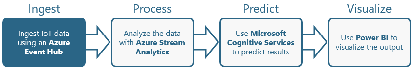

Lorem ipsum dolor sit amet, consectetur adipiscing elit. Vivamus pellentesque at odio quis varius. Nam vel lobortis mi. Proin accumsan pulvinar nibh rhoncus vehicula. Phasellus sollicitudin, arcu dictum tristique tristique, dolor justo tincidunt dolor, sit amet molestie leo nunc quis nisl. Integer nec euismod sapien, sit amet scelerisque quam. Vivamus sed efficitur elit. Donec bibendum bibendum faucibus. Suspendisse eu urna ut eros auctor tempus. Nunc tincidunt feugiat scelerisque. Vestibulum lobortis at lacus vitae ultricies.

In congue sapien eget nibh pretium feugiat. Donec et dictum justo, eget volutpat purus. In quis arcu leo. Cras aliquet ipsum elit. Vivamus ut tristique ipsum. Aenean sapien quam, aliquam ut justo id, congue pellentesque dui. Cras molestie, dui ut ullamcorper vulputate, erat odio condimentum ipsum, sed egestas sem turpis in massa. Maecenas cursus posuere felis, vel condimentum risus hendrerit et. Fusce vitae nisl elementum ipsum laoreet ultricies in vel libero. Nulla dolor metus, gravida eget tempor eget, vehicula vitae ante. Aliquam consequat rhoncus lacus, vitae blandit risus placerat non. Cras pharetra nunc quis mauris sagittis, at fringilla nibh placerat. Suspendisse a urna vel ante sollicitudin iaculis. Maecenas fringilla mi at massa aliquam, eget feugiat erat convallis.

### Objectives ###

In this hands-on lab, you will learn how to:

- tk
- tk
- tk

### Prerequisites ###

The following are required to complete this hands-on lab:

- An active Microsoft Azure subscription. If you don't have one, [sign up for a free trial](http://aka.ms/WATK-FreeTrial).
- tk
- tk

---

## Exercises ##

This hands-on lab includes the following exercises:

- [Exercise 1: tk](#Exercise1)
- [Exercise 2: tk](#Exercise2)
- [Exercise 3: tk](#Exercise3)

Estimated time to complete this lab: **tk** minutes.

## Exercise 1: tk ##

TODO: Add introduction.

1. Open the [Azure Portal](https://portal.azure.com) in your browser. If asked to log in, do so using your Microsoft account.

1. tk.

	

	_tk_

1. tk.

	

	_tk_

1. tk.

	

	_tk_

1. tk.

	

	_tk_

1. tk.

	

	_tk_

TODO: Add closing.

## Exercise 2: tk ##

TODO: Add introduction.

1. tk.

	

	_tk_

1. tk.

	

	_tk_

1. tk.

	

	_tk_

1. tk.

	

	_tk_

1. tk.

	

	_tk_

TODO: Add closing.

## Exercise 3: tk ##

TODO: Add introduction.

1. tk.

	

	_tk_

1. tk.

	

	_tk_

1. tk.

	

	_tk_

1. tk.

	

	_tk_

1. tk.

	

	_tk_

TODO: Add closing.

## Summary ##

TODO: Add summary.

---

Copyright 2017 Microsoft Corporation. All rights reserved. Except where otherwise noted, these materials are licensed under the terms of the MIT License. You may use them according to the license as is most appropriate for your project. The terms of this license can be found at https://opensource.org/licenses/MIT.
