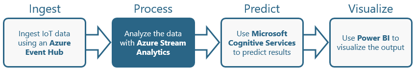

[Azure Stream Analytics](https://azure.microsoft.com/services/stream-analytics/) is a cloud-based service for ingesting high-velocity data streaming from devices, sensors, applications, Web sites, and other data sources and analyzing that data in real time. It supports a [SQL-like query language](https://msdn.microsoft.com/library/azure/dn834998.aspx) that works over dynamic data streams and makes analyzing constantly changing data no more difficult than performing queries on static data stored in traditional databases. With Azure Stream Analytics, you can set up jobs that analyze incoming data for anomalies or information of interest and record the results, present notifications on dashboards, or even fire off alerts to mobile devices. And all of it can be done at low cost and with a minimum of effort.

Scenarios for the application of real-time data analytics are legion and include fraud detection, identity-theft protection, optimizing the allocation of resources (think of an Uber-like transportation service that sends drivers to areas of increasing demand *before* that demand peaks), click-stream analysis on Web sites, and countless others. Having the ability to process data *as it comes in* rather than waiting until after it has been aggregated offers a competitive advantage to businesses that are agile enough to make adjustments on the fly.

In this lab, the second of four in a series, you will create an Azure Stream Analytics job and connect it to the IoT hub you created in the [previous lab](#). Then you will use it to analyze data streaming in from the simulated camera array that provides input to the IoT hub. 

### Objectives ###

In this hands-on lab, you will learn how to:

- Create a Stream Analytics job and test queries on sample data streams
- Run a Stream Analytics job and perform queries on live data streams

### Prerequisites ###

The following are required to complete this hands-on lab:

- An active Microsoft Azure subscription. If you don't have one, [sign up for a free trial](http://aka.ms/WATK-FreeTrial).
- [Node.js](https://nodejs.org/)

If you haven't completed the [previous lab in this series](#), you must do so before starting this lab.

---

## Exercises ##

This hands-on lab includes the following exercises:

- [Exercise 1: Create a Stream Analytics job](#Exercise1)
- [Exercise 2: Prepare a query and test with sample data](#Exercise2)
- [Exercise 3: Stream data from the camera array](#Exercise4)
- [Exercise 4: Analyze the live data stream](#Exercise4)

Estimated time to complete this lab: **30** minutes.

## Exercise 1: Create a Stream Analytics job ##

In this exercise, you will use the Azure Portal to create a Stream Analytics job and connect it to the IoT hub you created in the previous lab.

1. Open the [Azure Portal](https://portal.azure.com) in your browser. If asked to log in, do so using your Microsoft account.

1. Click **+ New**, followed by **Internet of Things** and **Stream Analytics job**.

    

    _Creating a Stream Analytics job_

1. Name the job "polar-bear-analytics" and place it in the "streaminglab-rg" resource group that you created in the previous lab. Specify **South Central US** as the location. (That's important, because your IoT hub is in the same region, and while you are not charged for data that moves within a data center, you typically *are* charged for data that moves *between* data centers. In addition, locating services that talk to each other in the same region reduces latency.) Make sure **Hosting environment** is set to **Cloud**, and then click the **Create** button.

    

    _Specifying parameters for the Stream Analytics job_

1. Open the "streaminglab-rg" resource group and click **polar-bear-analytics** to open the Stream Analytics job in the portal. If the Stream Analytics doesn't appear in the resource group, click the **Refresh** button at the top of the blade until it does.

    

    _Opening the Stream Analytics job_

1. Click **Inputs** to add an input to the Stream Analytics job.

    

    _Adding an input_

1. Click **+ Add**.

    

    _Adding an input_

1. Type "CameraInput" (without quotation marks) into the **Input alias** box. Make sure **Source Type** is set to **Data stream** and set **Source** to **IoT hub**. Select the IoT hub that you created in the previous lab and accept the defaults everywhere else. Then click the **Create** button at the bottom of the blade.

    

    _Creating an input_

After a few moments, the new input — "CameraInput" — appears in the list of inputs for the Stream Analytics job. This is the only input you will create, but be aware that you can add any number of inputs to a Stream Analytics job. In the [Stream Analytics Query Language](https://msdn.microsoft.com/library/azure/dn834998.aspx), each input is treated as a separate data source similar to tables in a relational database. The query language is extremely expressive, even allowing input streams to be joined in a manner similar to joining database tables.

## Exercise 2: Prepare a query and test with sample data ##

The heart of a Stream Analytics job is the query that extracts information from the data stream. It is always a good idea to test a query using sample data before deploying it against a live data stream, because with sample data, you can verify that a known set of inputs produces the expected outputs.

In this exercise, you will enter a query into the Stream Analytics job you created in the previous exercise and test it with sample data provided for you.

1. tk.

	

	_tk_

1. tk.

	

	_tk_

1. tk.

	

	_tk_

1. tk.

	

	_tk_

1. tk.

	

	_tk_

TODO: Add closing.

## Exercise 3: Stream data from the camera array ##

TODO: Add introduction.

1. tk.

	

	_tk_

1. tk.

	

	_tk_

1. tk.

	

	_tk_

1. tk.

	

	_tk_

1. tk.

	

	_tk_

TODO: Add closing.

## Exercise 4: Analyze the live data stream ##

TODO: Add introduction.

1. tk.

	

	_tk_

1. tk.

	

	_tk_

1. tk.

	

	_tk_

1. tk.

	

	_tk_

1. tk.

	

	_tk_

TODO: Add closing.

## Summary ##

TODO: Add summary.

---

Copyright 2017 Microsoft Corporation. All rights reserved. Except where otherwise noted, these materials are licensed under the terms of the MIT License. You may use them according to the license as is most appropriate for your project. The terms of this license can be found at https://opensource.org/licenses/MIT.
