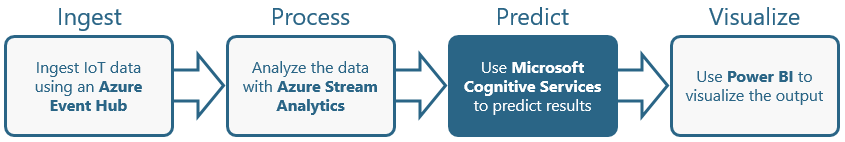

[Microsoft Cognitive Services](https://azure.microsoft.com/en-us/services/cognitive-services/ "Microsoft Cognitive Services") is a suite of services and APIs backed by machine learning that enables developers to incorporate intelligent features such as facial recognition in photos and videos, sentiment analysis in text, and language understanding into their applications. Microsoft's [Custom Vision Service](https://azure.microsoft.com/en-us/services/cognitive-services/custom-vision-service/) is among the newest members of the Cognitive Services suite. Its purpose is to create image-classification models that "learn" from labeled images you provide. Want to know if a photo contains a picture of a flower? Train the Custom Vision Service with a collection of flower images, and it can tell you whether the next image includes a flower — or even what type of flower it is.

The Custom Vision Service exposes two APIs: the [Custom Vision Training API](https://southcentralus.dev.cognitive.microsoft.com/docs/services/d9a10a4a5f8549599f1ecafc435119fa/operations/58d5835bc8cb231380095be3) and the [Custom Vision Prediction API](https://southcentralus.dev.cognitive.microsoft.com/docs/services/eb68250e4e954d9bae0c2650db79c653/operations/58acd3c1ef062f0344a42814). You can build, train, and test image-classification models using the [Custom Vision Service portal](https://www.customvision.ai/), or you can build, train, and test them using the Custom Vision Training API. Once a model is trained, you can use the Custom Vision Prediction API to build apps that utilize it. Both are REST APIs that can be called from a variety of programming languages.

In this lab, the third of four in a series, you will create a Custom Vision Service model and train it to differentiate between various types of Arctic wildlife. Then you will connect it to the Stream Analytics job you created in [Part 2](#).



<a name="Objectives"></a>
### Objectives ###

In this hands-on lab, you will learn how to:

- Use the Custom Vision Service to train an image-classification model
- Test a Custom Vision Service model
- Call the model from an app or service

<a name="Prerequisites"></a>
### Prerequisites ###

The following are required to complete this hands-on lab:

- An active Microsoft Azure subscription. If you don't have one, [sign up for a free trial](http://aka.ms/WATK-FreeTrial).

If you haven't completed the [previous lab in this series](#), you must do so before starting this lab.

---

<a name="Exercises"></a>
## Exercises ##

This hands-on lab includes the following exercises:

- [Exercise 1: Build a Custom Vision Service model](#Exercise1)
- [Exercise 2: Train and test the model](#Exercise2)
- [Exercise 3: Connect the Stream Analytics job](#Exercise3)

Estimated time to complete this lab: **30** minutes.

<a name="Exercise1"></a>
## Exercise 1: Build a Custom Vision Service model ##

In this exercise, you will create a new Custom Vision Service project. Then you will upload images of polar bears, arctic foxes, and walruses and tag the images so the Custom Vision Service can learn to differentiate between them.

1. Open the [Custom Vision Service portal](https://www.customvision.ai/) in your browser. Then click **Sign In** and sign in with your Microsoft account. 
 
    

    _Signing in to the Custom Vision Service portal_

1. Click **New Project** to display the "New project" dialog. Enter a project name,  ensure that **General** is selected as the domain, and click **Create project**.

	> A domain optimizes a model for specific types of images. For example, if your goal is to classify food images by the types of food they contain or the ethnicity of the dishes, then it might be helpful to select the Food domain. For scenarios that don't match any of the offered domains, or if you are unsure of which domain to choose, select the General domain.

	

    _Creating a Custom Vision Service project_

1. Click **Add images** to add images to the project.

	

    _Adding images to the project_ 
 
1. Click **Browse local files**. Browse to the folder containing the resources that accompany this lab and select all of the files in the "Training/Arctic Fox" directory. Then OK the selection, enter "Arctic fox" as the tag for the images, and click the **Upload 130 files** button. Wait for the upload to complete, and then click **Done**.

	

    _Uploading Arctic-fox images_ 
 
1. Click **Add images** at the top of the page and repeat the previous step to upload all of the images in the "Training/Polar Bear" directory to the Custom Vision Service and tag them with the term "Polar bear." Wait for the upload to complete, and then click **Done**.

	

    _Uploading polar-bear images_ 

1. Repeat the previous step to upload all of the images in the "Training/Walrus" directory to the Custom Vision Service and tag them with the term "Walrus." Wait for the upload to complete, and then click **Done**.

	

    _Uploading polar-bear images_ 

With the images tagged and uploaded, the next step is to train the model so it can distinguish between Arctic foxes, polar bears, and walruses, as well as determine whether an image contains one of these animals.

<a name="Exercise2"></a>
## Exercise 2: Train and test the model ##

In this exercise, you will train the model using the images that you tagged and uploaded in the previous exercise. Then you will test the model to determine how adept it is at identifying Arctic wildlife from photos. Training can be accomplished with a simple button click in the portal, or by calling the [TrainProject](https://southcentralus.dev.cognitive.microsoft.com/docs/services/d9a10a4a5f8549599f1ecafc435119fa/operations/58d5835bc8cb231380095bed) method in the [Custom Vision Training API](https://southcentralus.dev.cognitive.microsoft.com/docs/services/d9a10a4a5f8549599f1ecafc435119fa/operations/58d5835bc8cb231380095be3). Once trained, a model can be refined by uploading additional tagged images and retraining it.

1. Click the **Train** button at the top of the page to train the model. Each time you train the model, a new iteration is created. The Custom Vision Service maintains several iterations, allowing you to compare your progress over time.

1. Wait for the training process to complete. (It should only take a few seconds.) Then review the training statistics presented to you for iteration 1.

	

    _Results of training the model_ 

	**Precision** and **recall** are separate but related  measures of the model's accuracy. Suppose the model was presented with three polar-bear images and three walrus images, and that it correctly identified two of the polar-bear images as polar-bear images, but incorrectly identified two of the walrus images as polar-bear images. In this case, the precision would be 50% (two of the four images it classified as polar-bear images actually are polar-bear images), while its recall would be 67% (it correctly identified two of the three polar-bear images as polar-bear images). You can learn more about precision and recall from https://en.wikipedia.org/wiki/Precision_and_recall.

1. Now let's test the model using the portal's Quick Test feature, which allows you to submit images to the model and see how it classifies them using the knowledge gained from the training images.

	Click the **Quick Test** button at the top of the page. Then click **Browse local files**, browse to the "Testing/Polar bear" directory in the resources accompanying this lab, and select any one of the test images in that directory.

1. Examine the results of the test in the "Quick Test" dialog. What is the probability that the image contains a polar bear? What is the probability that it contains an Arctic fox or a walrus?

	

	_Testing the model with a polar-bear image_

1. Repeat this test with one of the images in the "Testing/Arctic Fox" directory. How well is the model able to differentiate between Arctic foxes and polar bears?

	

	_Testing the model with an Arctic-fox image_

The "Testing" directory in the lab resources contains subdirectories with a total of 30 different images for testing. Perform additional quick tests using these images until you are satisfied that the model is reasonably adept at predicting whether an image contains a polar bear.

<a name="Exercise3"></a>
## Exercise 3: Connect the Stream Analytics job ##

In this exercise, you will modify the Stream Analytics job that you created in the previous lab to call the Custom Vision Service model and determine the likelihood that an image that *might* contain a polar bear *does* contain a polar bear.

1. In the Custom Vision Portal, go to the "Performance" tab if it isn't already the active tab. Click **Make default** to make sure the latest iteration of the model is the default iteration. Then click **Prediction URL**.

	

    _Specifying the default iteration_ 

1. The ensuing dialog lists two URLs: one for uploading images via URL, and another for uploading local images. Copy the former to the clipboard, and then paste it into your favorite text editor so you can retrieve it later. Do the same for the ```Prediction-Key``` value underneath the URL. This value must be passed in each call to the URL above. 

	

    _Copying the Prediction API URL_ 

1. tk.

	

	_tk_

1. tk.

	

	_tk_

1. tk.

	

	_tk_

TODO: Add closing.

<a name="Summary"></a>
## Summary ##

TODO: Add summary.

---

Copyright 2017 Microsoft Corporation. All rights reserved. Except where otherwise noted, these materials are licensed under the terms of the MIT License. You may use them according to the license as is most appropriate for your project. The terms of this license can be found at https://opensource.org/licenses/MIT.
