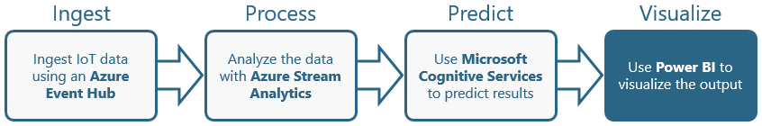

[Microsoft Power BI](https://powerbi.microsoft.com/en-us/mobile/) was created to address the data explosion in commercial and academic organizations, the need to analyze that data, and the need for rich, interactive visuals to represent the data and reveal key insights. It contains a suite of tools that assist in the full life cycle of data analysis, from data discovery and collection to data transformation, aggregation, visualization, sharing, and collaboration. Moreover, it allows you to create rich visualizations and present them in interactive dashboards.

[Microsoft Power BI Embedded](https://azure.microsoft.com/en-us/services/power-bi-embedded/ "Microsoft Power BI Embedded") is an Azure service that enables developers to surface Power BI reports in their apps and Web sites without requiring users to have Power BI accounts. Reports are created in [Power BI Desktop](https://powerbi.microsoft.com/desktop/) and saved as PBIX files. These PBIX files are then imported into Power BI Embedded using APIs provided for that purpose and used to embed interactive charts and graphs. The process is accomplished primarily through calls to REST APIs (or SDKs that wrap those APIs) and is well documented in articles such as [Get started with Microsoft Power BI Embedded](https://docs.microsoft.com/azure/power-bi-embedded/power-bi-embedded-get-started) and [Embed a report in Power BI Embedded](https://docs.microsoft.com/azure/power-bi-embedded/power-bi-embedded-embed-report).

In this lab, the fourth of four in a series, you will tk.

### Objectives ###

In this hands-on lab, you will learn how to:

- tk
- tk
- tk

### Prerequisites ###

The following are required to complete this hands-on lab:

- An active Microsoft Azure subscription. If you don't have one, [sign up for a free trial](http://aka.ms/WATK-FreeTrial).
- tk
- tk

If you haven't completed the [previous lab in this series](#), you must do so before starting this lab.

---

## Exercises ##

This hands-on lab includes the following exercises:

- [Exercise 1: tk](#Exercise1)
- [Exercise 2: tk](#Exercise2)
- [Exercise 3: tk](#Exercise3)

Estimated time to complete this lab: **tk** minutes.

## Exercise 1: tk ##

TODO: Add introduction.

1. Open the [Azure Portal](https://portal.azure.com) in your browser. If asked to log in, do so using your Microsoft account.

1. tk.

	

	_tk_

1. tk.

	

	_tk_

1. tk.

	

	_tk_

1. tk.

	

	_tk_

1. tk.

	

	_tk_

TODO: Add closing.

## Exercise 2: tk ##

TODO: Add introduction.

1. tk.

	

	_tk_

1. tk.

	

	_tk_

1. tk.

	

	_tk_

1. tk.

	

	_tk_

1. tk.

	

	_tk_

TODO: Add closing.

## Exercise 3: tk ##

TODO: Add introduction.

1. tk.

	

	_tk_

1. tk.

	

	_tk_

1. tk.

	

	_tk_

1. tk.

	

	_tk_

1. tk.

	

	_tk_

TODO: Add closing.

## Summary ##

TODO: Add summary.

---

Copyright 2017 Microsoft Corporation. All rights reserved. Except where otherwise noted, these materials are licensed under the terms of the MIT License. You may use them according to the license as is most appropriate for your project. The terms of this license can be found at https://opensource.org/licenses/MIT.
